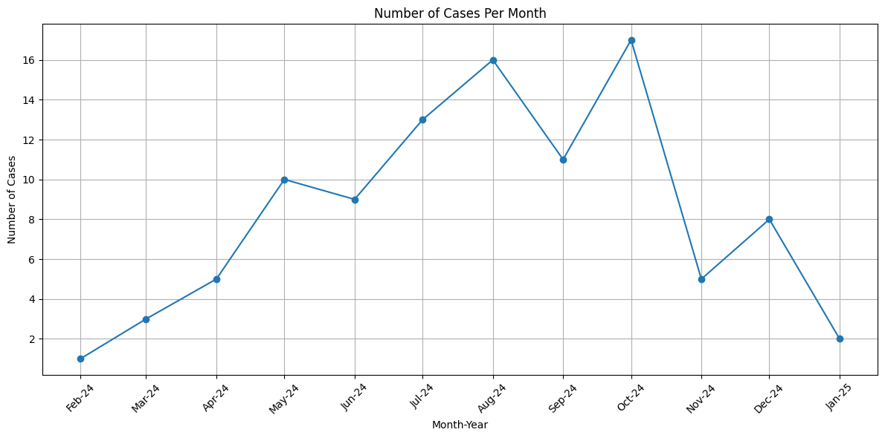
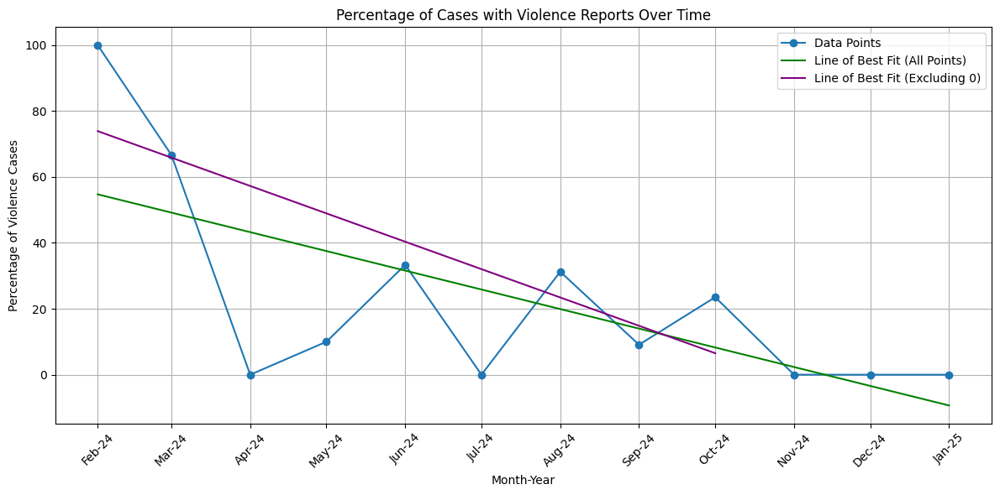
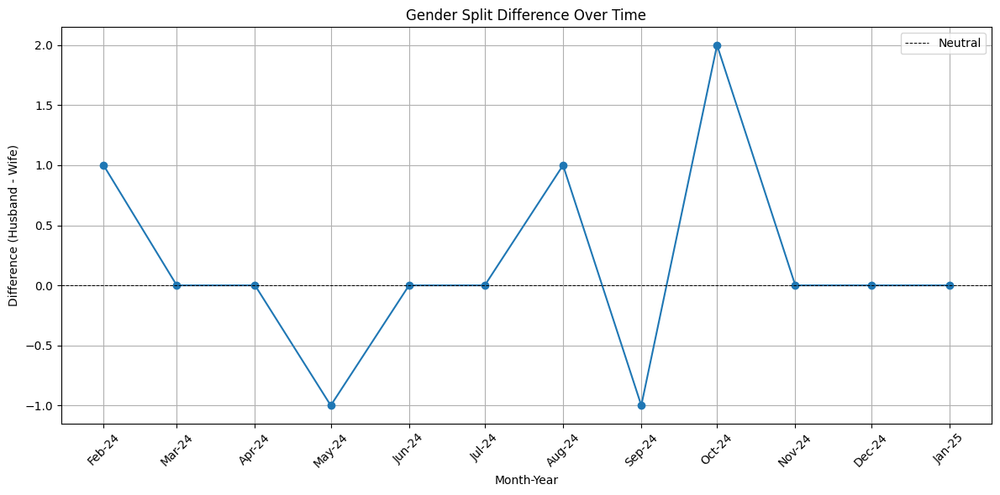
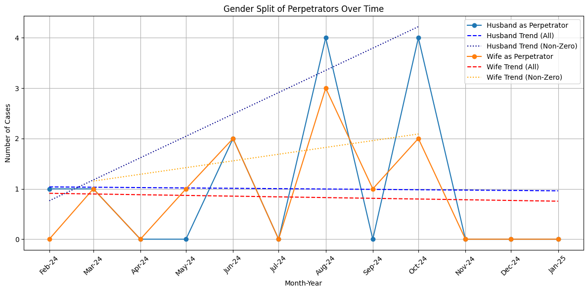
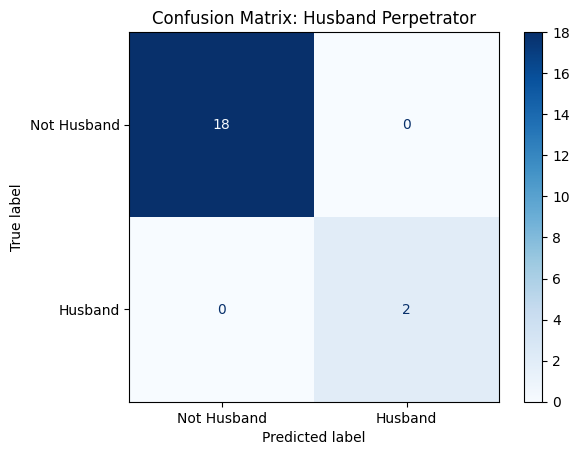
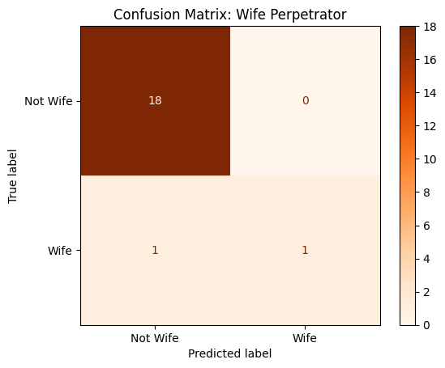
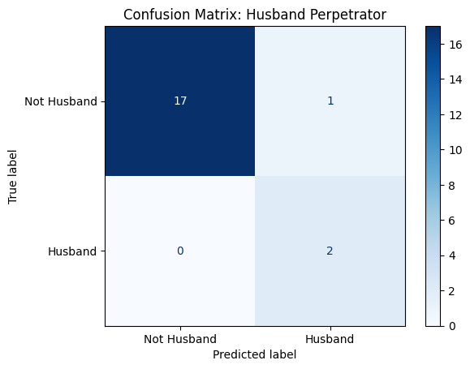
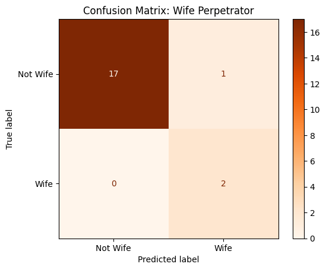

# Text Investigation Project - Kamal Ashraf Bin Kamil Jumat

# Introduction
This Text Investigation Project examines trends in gendered violence in Family Justice Courts Judgments.

# Readjustment of Research Inquiry

My initial research question was to examine the trends in emotive language in Singapore Family Justice Court reported judgments.

Since then, I have encountered a major issue. I have discovered that the Judges use little to no emotive language in Singapore Family Justice Court decisions, unlike the language of judges examined in class such as Lord Denning.

In light of this, I have amended my research inquiry. __I now aim to investigate the trends in violence over time as they relate to the husband and wife in these judgments__. My corpus remains the same, as do my use of NLP techniques.

__Scope of Research__

The below Exploratory Data Analysis involves 100 reported Family Justice Courts judgments spanning from February 2024 to January 2025. I will be examining these key inquiries:

1. Whether there is a discernible trend in the proportion of reported judgments involving family violence
2. Whether there is a dicernible trend in the split between male and female (or husband and wife among other descriptors) perpetrators in family violence cases

This Exploratory Data Analysis Section includes the following techniques:
1. Dataset loading
2. Data cleaning
3. Word frequency -  as a testing ground for my Keywords
4. Concordance - to examine the context in which keywords are said
5. Collocation - to examine recurring words/phrases as relevant
6. SpaCy-based PoS tagging - to establish and track Perpetrator-Act relationships
7. Visualisation of Data involving four graphs

# Importing of Libraries

Relevant libraries imported for text cleaning, data manipulation, concordance, collocation, tokenisation and visualiation

# Loading of Dataset

The .json file was obtained from https://github.com/hueyy/lacuna-db, a freely accessible github repo operated by Huey Lee (who I recently discovered teaches at NUS).
I required the help of Perplexity AI to help load the dataset, as the text to be extracted was nested within rows containing metadata. The laoded dataset was converted to a DataFrame.

The codeblock prints the total number of cases in the dataset, confirming that it contains exactly 100 cases. It also prints out the df.head() of the dataframe. The data will be cleaned in later blocks and this will be reflected when df.head() is called at later points.

    Total number of cases in the dataset: 100

<table border="1" class="dataframe">
  <thead>
    <tr style="text-align: right;">
      <th></th>
      <th>_id</th>
      <th>_item_id</th>
      <th>tags</th>
      <th>date</th>
      <th>court</th>
      <th>case-number</th>
      <th>title</th>
      <th>citation</th>
      <th>url</th>
      <th>counsel</th>
      <th>timestamp</th>
      <th>coram</th>
      <th>html</th>
      <th>_commit</th>
    </tr>
  </thead>
  <tbody>
    <tr>
      <th>0</th>
      <td>116</td>
      <td>fa6565e2c0d7fc6e2a308b44ccde2d00add2195b</td>
      <td>["Family Law – matrimonial assets – matrimonia...</td>
      <td>2025-01-02</td>
      <td>Family Court</td>
      <td>Divorce No 2385 of 2022</td>
      <td>XGW v XGX</td>
      <td>[2025] SGFC 2</td>
      <td>https://www.lawnet.sg:443/lawnet/web/lawnet/fr...</td>
      <td>["Mr Joseph Chen (Joseph Chen &amp; Co) for the Pl...</td>
      <td>2025-01-08T16:00:00Z[GMT]</td>
      <td>Nicole Loh</td>
      <td>&lt;root&gt;&lt;head&gt;&lt;title&gt;XGW v XGX&lt;/title&gt;&lt;/head&gt;&lt;co...</td>
      <td>1957</td>
    </tr>
    <tr>
      <th>1</th>
      <td>118</td>
      <td>3767581f29c7b98b91a485448806e1bc488c4f06</td>
      <td>["Family law – Matrimonial proceedings – Juris...</td>
      <td>2025-01-02</td>
      <td>Family Court</td>
      <td>Divorce Suit No. 249 of 2023, (Summons No. 930...</td>
      <td>XFS v XFT</td>
      <td>[2025] SGFC 1</td>
      <td>https://www.lawnet.sg:443/lawnet/web/lawnet/fr...</td>
      <td>["Mr Chiok Beng Piow (AM Legal LLC) and Ms Chu...</td>
      <td>2025-01-10T16:00:00Z[GMT]</td>
      <td>Kevin Ho</td>
      <td>&lt;root&gt;&lt;head&gt;&lt;title&gt;XFS v XFT&lt;/title&gt;&lt;/head&gt;&lt;co...</td>
      <td>1959</td>
    </tr>
    <tr>
      <th>2</th>
      <td>115</td>
      <td>7a13ddf029d45ad3ee3fed5ad26d10c17aed9783</td>
      <td>["Family Law – Guardianship of Infants Act – S...</td>
      <td>2024-12-31</td>
      <td>Family Court</td>
      <td>FC/OSG 12/2022</td>
      <td>XGE v XGF</td>
      <td>[2024] SGFC 109</td>
      <td>https://www.lawnet.sg:443/lawnet/web/lawnet/fr...</td>
      <td>["Mrs Quah Li Hwee Patricia (Patricia Quah &amp; C...</td>
      <td>2025-01-07T16:00:00Z[GMT]</td>
      <td>Cassandra Cheong</td>
      <td>&lt;root&gt;&lt;head&gt;&lt;title&gt;XGE v XGF&lt;/title&gt;&lt;/head&gt;&lt;co...</td>
      <td>1956</td>
    </tr>
    <tr>
      <th>3</th>
      <td>117</td>
      <td>0e9759396ea127f2e76ef07bbadd3bc6fa6f32b5</td>
      <td>["Family Law – Ancillary powers of court – Par...</td>
      <td>2024-12-23</td>
      <td>Family Court</td>
      <td>Divorce No 4937 of 2021, Summons No. 3012 of 2...</td>
      <td>WQF v WQG</td>
      <td>[2024] SGFC 113</td>
      <td>https://www.lawnet.sg:443/lawnet/web/lawnet/fr...</td>
      <td>["Ryan Yu Gen Xian (M/s Aspect Law Chambers LL...</td>
      <td>2025-01-08T16:00:00Z[GMT]</td>
      <td>Kow Keng Siong</td>
      <td>&lt;root&gt;&lt;head&gt;&lt;title&gt;WQF v WQG&lt;/title&gt;&lt;/head&gt;&lt;co...</td>
      <td>1957</td>
    </tr>
    <tr>
      <th>4</th>
      <td>111</td>
      <td>3453fa1b35168d2613cdc6ebed7e59f40ee3dca2</td>
      <td>["Family Law – Family violence – Orders for pr...</td>
      <td>2024-12-13</td>
      <td>Family Court</td>
      <td>SS No. 1031 of 2024</td>
      <td>XGG v XGH</td>
      <td>[2024] SGFC 111</td>
      <td>https://www.lawnet.sg:443/lawnet/web/lawnet/fr...</td>
      <td>["Gurdaib Kumar Singh and Ms Divya Durai (M/s ...</td>
      <td>2024-12-20T16:00:00Z[GMT]</td>
      <td>Kow Keng Siong</td>
      <td>&lt;root&gt;&lt;head&gt;&lt;title&gt;XGG v XGH&lt;/title&gt;&lt;/head&gt;&lt;co...</td>
      <td>1909</td>
    </tr>
  </tbody>
</table>

# Text Cleaning

To get usable text, the text data has to be cleaned in several stages. Firstly, a HTMl tag remover function is defined using BeautifulSoup.

Then, footnotes and legal citations are also removed, leaving clean sentences that are less prone to noise later on.

<table border="1" class="dataframe">
  <thead>
    <tr style="text-align: right;">
      <th></th>
      <th>_id</th>
      <th>_item_id</th>
      <th>tags</th>
      <th>date</th>
      <th>court</th>
      <th>case-number</th>
      <th>title</th>
      <th>citation</th>
      <th>url</th>
      <th>counsel</th>
      <th>timestamp</th>
      <th>coram</th>
      <th>html</th>
      <th>_commit</th>
      <th>clean_text</th>
    </tr>
  </thead>
  <tbody>
    <tr>
      <th>0</th>
      <td>116</td>
      <td>fa6565e2c0d7fc6e2a308b44ccde2d00add2195b</td>
      <td>["Family Law – matrimonial assets – matrimonia...</td>
      <td>2025-01-02</td>
      <td>Family Court</td>
      <td>Divorce No 2385 of 2022</td>
      <td>XGW v XGX</td>
      <td>[2025] SGFC 2</td>
      <td>https://www.lawnet.sg:443/lawnet/web/lawnet/fr...</td>
      <td>["Mr Joseph Chen (Joseph Chen &amp; Co) for the Pl...</td>
      <td>2025-01-08T16:00:00Z[GMT]</td>
      <td>Nicole Loh</td>
      <td>&lt;root&gt;&lt;head&gt;&lt;title&gt;XGW v XGX&lt;/title&gt;&lt;/head&gt;&lt;co...</td>
      <td>1957</td>
      <td>Family Law – matrimonial assets – matrimonial...</td>
    </tr>
    <tr>
      <th>1</th>
      <td>118</td>
      <td>3767581f29c7b98b91a485448806e1bc488c4f06</td>
      <td>["Family law – Matrimonial proceedings – Juris...</td>
      <td>2025-01-02</td>
      <td>Family Court</td>
      <td>Divorce Suit No. 249 of 2023, (Summons No. 930...</td>
      <td>XFS v XFT</td>
      <td>[2025] SGFC 1</td>
      <td>https://www.lawnet.sg:443/lawnet/web/lawnet/fr...</td>
      <td>["Mr Chiok Beng Piow (AM Legal LLC) and Ms Chu...</td>
      <td>2025-01-10T16:00:00Z[GMT]</td>
      <td>Kevin Ho</td>
      <td>&lt;root&gt;&lt;head&gt;&lt;title&gt;XFS v XFT&lt;/title&gt;&lt;/head&gt;&lt;co...</td>
      <td>1959</td>
      <td>Family law – Matrimonial proceedings – Jurisd...</td>
    </tr>
    <tr>
      <th>2</th>
      <td>115</td>
      <td>7a13ddf029d45ad3ee3fed5ad26d10c17aed9783</td>
      <td>["Family Law – Guardianship of Infants Act – S...</td>
      <td>2024-12-31</td>
      <td>Family Court</td>
      <td>FC/OSG 12/2022</td>
      <td>XGE v XGF</td>
      <td>[2024] SGFC 109</td>
      <td>https://www.lawnet.sg:443/lawnet/web/lawnet/fr...</td>
      <td>["Mrs Quah Li Hwee Patricia (Patricia Quah &amp; C...</td>
      <td>2025-01-07T16:00:00Z[GMT]</td>
      <td>Cassandra Cheong</td>
      <td>&lt;root&gt;&lt;head&gt;&lt;title&gt;XGE v XGF&lt;/title&gt;&lt;/head&gt;&lt;co...</td>
      <td>1956</td>
      <td>Family Law – Guardianship of Infants Act – Sh...</td>
    </tr>
    <tr>
      <th>3</th>
      <td>117</td>
      <td>0e9759396ea127f2e76ef07bbadd3bc6fa6f32b5</td>
      <td>["Family Law – Ancillary powers of court – Par...</td>
      <td>2024-12-23</td>
      <td>Family Court</td>
      <td>Divorce No 4937 of 2021, Summons No. 3012 of 2...</td>
      <td>WQF v WQG</td>
      <td>[2024] SGFC 113</td>
      <td>https://www.lawnet.sg:443/lawnet/web/lawnet/fr...</td>
      <td>["Ryan Yu Gen Xian (M/s Aspect Law Chambers LL...</td>
      <td>2025-01-08T16:00:00Z[GMT]</td>
      <td>Kow Keng Siong</td>
      <td>&lt;root&gt;&lt;head&gt;&lt;title&gt;WQF v WQG&lt;/title&gt;&lt;/head&gt;&lt;co...</td>
      <td>1957</td>
      <td>Family Law – Ancillary powers of court – Part...</td>
    </tr>
    <tr>
      <th>4</th>
      <td>111</td>
      <td>3453fa1b35168d2613cdc6ebed7e59f40ee3dca2</td>
      <td>["Family Law – Family violence – Orders for pr...</td>
      <td>2024-12-13</td>
      <td>Family Court</td>
      <td>SS No. 1031 of 2024</td>
      <td>XGG v XGH</td>
      <td>[2024] SGFC 111</td>
      <td>https://www.lawnet.sg:443/lawnet/web/lawnet/fr...</td>
      <td>["Gurdaib Kumar Singh and Ms Divya Durai (M/s ...</td>
      <td>2024-12-20T16:00:00Z[GMT]</td>
      <td>Kow Keng Siong</td>
      <td>&lt;root&gt;&lt;head&gt;&lt;title&gt;XGG v XGH&lt;/title&gt;&lt;/head&gt;&lt;co...</td>
      <td>1909</td>
      <td>Family Law – Family violence – Orders for pro...</td>
    </tr>
  </tbody>
</table>

This above section shows the dataframe with clean text. The line of code below outputs an example of the cleaned text.

    ' Family law – Matrimonial proceedings – Jurisdiction – Whether parties who have consented to the grant of interim judgment entitled to a stay of ancillary reliefs on the ground of forum non conveniens Family law – Ancillary powers of court – Pre-nuptial agreements – Whether case management stay should be granted pending conclusion of foreign proceedings on validity of pre-nuptial agreement Conflict of laws – Natural forum – Stay of proceedings – Whether Singapore court is an appropriate forum in light of concurrent foreign proceedings 2 January 2025 District Judge Kevin Ho: Introduction 1 The present application, vide . FC/SUM 930/2023 (“SUM 930”), was filed by the Defendant-Husband (“Husband”) in March 2023 seeking a stay of the divorce proceedings in FC/D 249/2023 (“D 249”) which were commenced by the Plaintiff-Wife (“Wife”). 2 To better appreciate the context surrounding the present application and the implications of the orders sought in SUM 930, one must first consider the procedural history of D 249. 3 The Wife commenced D 249 in January 2023. The Husband, who was served the divorce papers, filed a Memorandum of Appearance around a month later indicating his intention to contest the proceedings. 4 The Husband then filed SUM 930 on 22 March 2023 and sought a stay of the divorce proceedings pending the conclusion of a specific legal action in Israel (which he had commenced against the Wife) on the ground of “ forum non conveniens ”. This was followed by a Defence and Counterclaim which the Husband filed in May 2023. 5 In a somewhat unusual turn of events, the parties reached an agreement that they would proceed with D 249 on an uncontested basis in relation to the grounds of divorce ( ie . on both the Wife’s and the Husband’s unreasonable behaviour). Both parties filed amended pleadings in September 2023 – the Wife filed her amended Statement of Claim and Statement Particulars, and the Husband filed his amended Counterclaim. 6 Interim Judgment for Divorce (“IJ”) was thus granted on 7 November 2023. 7 Even though the IJ had been granted, it remained the Husband’s position that he would continue to pursue SUM 930. That effectively meant that the stay of proceedings he had sought in SUM 930 would relate only to the proceedings for ancillary matters (“AM”) relief in D 249 since the grounds for the parties’ divorce were already fully and finally determined in the IJ. 8 Following the grant of the IJ, the Husband applied for and obtained permission from the Court to formally amend SUM 930 to refer only to the AM reliefs sought in the pleadings, as well as to include a general reference to all the legal proceedings which were pending before the Israeli courts (“Israeli Proceedings”). By that time, there were multiple lawsuits between the parties in Israel. I will address the Israeli Proceedings in greater detail later on in these grounds of decision. 9 By the time SUM 930 was heard by this Court, it transpired that much of the Israeli Proceedings have concluded, save that the Husband’s appeal against part of the Israeli Family Court’s earlier decision (“Israeli Appeal”) has not yet been heard. As such, the Husband – through his counsel – sought a permanent stay of D 249. The effect of such a stay would be that the remainder of the divorce proceedings, ie. the proceedings for AM reliefs (“AM Proceedings”), would be brought to an immediate end. 10 On 21 October 2024, I delivered my oral grounds of decision in respect of SUM 930. In summary, I dismissed the Husband’s application for a permanent stay and ordered that there be a limited case management stay of D 249 pending the conclusion of his Israeli Appeal. 11 Both parties have since appealed against my decision, vide. HCF/RAS 20/2024 and RAS 21/2024. These are my full grounds of decision. Stay on the Ground of Forum Non Conveniens 12 Given the procedural posture of the present proceedings, there was some initial debate between the parties’ counsel as to whether the Husband’s stay application remained grounded on the basis of forum non conveniens . This issue arose because despite the prayers in SUM 930 referring to phrase “ forum non conveniens ”, much of the Husband’s counsel’s arguments was focused on the impact and relevance of the parallel Israeli Proceedings, and the concern with multiplicity of proceedings in two jurisdictions, ie. Israel and Singapore. 13 Notwithstanding the somewhat unusual turn of events, I agreed with the Husband’s counsel that the principle of forum non conveniens remained a live issue between the parties, and was one of the legal bases relied upon by the Husband in support of SUM 930. This was evident from the fact that both counsel had filed detailed written submissions addressing this issue, and the principle itself was referred to in SUM 930. 14 Moreover, the concerns as regards lis alibi pendens in the present case arose as a result of the Husband’s subsequent Israeli legal action against the Wife, as compared to D 249 which was the Wife’s initial divorce application in Singapore against the Husband. The situation thus fell within what the Court of Appeal in Virsagi Management (S) Pte Ltd v Welltech Constructions Pte Ltd 4 SLR 1097 (“ Virsagi ”) had observed as being a “reversed parties situation”, ie. where a plaintiff sues a defendant in Singapore, and the same defendant then sues the plaintiff abroad (see Virsagi at ). The lis alibi pendens in such a situation operates within the doctrine of forum non conveniens , and is to be considered under the rubric of the general principles applicable to the doctrine (see Virsagi at and ). 15 I will therefore start by addressing the question of whether the Husband is entitled to seek a stay on the basis of forum non conveniens . 16 At the outset, I note that, in both parties’ written submissions, they accept that in considering the issue of forum non conveniens , the Family Court would apply the principles set out in Spiliada Maritime Corp v Cansulex 1 AC 460 (or the “ Spiliada test”) to determine whether a stay of divorce proceedings should be granted. I agree with the said approach as that is consistent with the prevailing caselaw: see at – . The latter is commonly referred to as the second stage of the Spiliada test. 19 At the second stage, the burden shifts to the responding party (ie. the Wife in the present case) to show the presence of “special circumstances” by reason of which justice requires that a stay should nevertheless be refused: see at ; (“ Humpuss ”)), the cases where the grant of such stays were discussed occurred in the context of a claimant having different civil claims (or causes of action) against the same defendant some of which could be pursued in another jurisdiction. 29 For example, the High Court in Humpuss (at of the judgment) referred to a situation where part of a party’s claims arose from a specific jurisdiction’s statutory law. Where such claims are brought alongside other general claims, the statutory cause of action may sometimes be partially stayed in favour of that forum so as to discourage litigants from tacking on claims with no obvious connection to the forum to claims which do. 30 However, those principles (which makes sense in the context of civil litigation) do not sit well with, and cannot be easily analogised to, divorce proceedings. 31 To begin with, the power of the Family Court to grant any form of AM relief is derived from (and consequent on) an interim judgment of divorce being granted to dissolve the parties’ marriage. In my view, one cannot exist without the other. 32 There are no separate causes of action or claims within the context of divorce proceedings because a party cannot apply to the Singapore Family Court to independently divide assets or seek a maintenance order, under Chapter 4 of the Women’s Charter 1961 (2020 Rev. Ed.) (“WC”), without first obtaining interim judgment from the same Singapore court. This is apparent from the statutory schema of the WC. 33 For example, s 112(1) of the WC (which is located within Chapter 4) gives the court the power to divide the parties’ matrimonial assets only “ when granting or subsequent to grant of a judgment of divorce ”. Section 113(1) similarly gives the court the power to order maintenance “ when granting or subsequent to grant of a judgment of divorce ”. Indeed, s 123 (in Chapter 5 of the WC) likewise directs the court not to make final any judgment of divorce unless arrangements have been made for the welfare of the child. 34 While the present marriage does not involve children, what is clear from the overall context of the provisions in the WC is that proceedings for ancillary relief (which relate to the financial consequences of a divorce and, where applicable, child-related orders) are intimately connected with, and are part of , the same claim for divorce. 35 To put matters in perspective, prior to 2011, it was well acknowledged that there was a “gap” in Singapore’s matrimonial law because the Singapore court had no powers to grant any AM relief independently, if it was not the court which granted the judgment for the parties’ divorce (see the Court of Appeal’s decision in at ). Parliament then had to statutorily enact Chapter 4A of the WC to specifically allow former spouses who were divorced in another jurisdiction to apply to the Singapore court for financial relief. 36 I was thus not persuaded by the Husband’s argument that the AM Proceedings should be considered a separate claim or cause of action which can be “severed” from a claim for the dissolution of the parties’ marriage. They are two inter-connected parts of the same claim. 37 Accordingly, the Husband was not entitled to seek a stay (whether fully or partially) of D 249 on the ground of forum non conveniens given that he had submitted to the Singapore court’s jurisdiction and had accepted its appropriateness to determine the parties’ divorce. It followed therefore that, by the Husband’s actions, he had acknowledged that the Singapore court was in fact the appropriate court to hear and determine the AM Proceedings. Israel is not a more appropriate forum 38 For completeness, even if the Husband was entitled to seek an independent stay of the AM Proceedings (contrary to my decision above) and I had applied the Spiliada test, I would not have found Israel to be a more appropriate forum in the present case. 39 In my view, apart from the fact that there were (and possibly continues to be) legal proceedings in the Israeli courts which the Husband had commenced against the Wife, no other factor clearly points to Israel being the appropriate jurisdiction. 40 In this regard, I accept the Wife’s submissions that both parties registered and celebrated their marriage in Singapore, and had lived in Singapore both before and after their marriage. They both applied for and had obtained Permanent Resident status in Singapore. The Wife is now a Singapore citizen. They also worked in Singapore and have significant assets in Singapore, including two Singaporean companies – [SGD] Pte Ltd and [AML] Pte Ltd. 41 The fact that they may also have an asset overseas (in the United States of America) was, in my view, inconclusive – it certainly does not point to the Israeli court as being the “more appropriate” forum. This is particularly so given that the stay sought by the Husband was only in relation to the AM reliefs to be granted by the Singapore court. 42 Overall, I was satisfied that all relevant connecting factors point to Singapore as being the appropriate forum. The Husband’s request for a stay on the ground of forum non conveniens was therefore not made out. Other Considerations 43 Before addressing the Husband’s other arguments, I wish to make clear that in reaching my conclusion that he was not entitled to seek a partial stay on the ground of forum non conveniens , I did not accept the Wife’s submission that because the WC was the “governing law” for marriages in Singapore, it meant that there were public policy considerations which would enjoin this Court to conclude that Singapore must be the most appropriate or, indeed, the only forum of choice. 44 In the main, the Wife’s submission was that since the parties registered their marriage in Singapore, the “just and equitable” division of assets regime (or the legal concept of a deferred community of property) envisaged under the WC should be seen as a manifestation of public policy operating to favour Singapore as the only jurisdiction of choice when it comes to the parties’ divorce. 45 In the context of modern-day marriages, spouses can come from different jurisdictions, geographical locations, and they can choose to register (or celebrate) their marriage in any number of countries. It does not seem logical to say that because the parties married in Singapore, ipso facto , Singapore’s domestic marriage laws must apply as a matter of “ public policy ”. 46 The Family Court, in considering whether a stay of proceedings ought to be granted, will still have to weigh the relevant connecting factors pursuant to the Spiliada test. Where the parties had registered their marriage and the applicable marriage laws of that forum are, at best, one of several considerations and would not be dispositive. 47 I should also add that my decision in the present case should not be taken as having expressed a definitive view that it is legally impermissible for spouses to agree to have their marriage dissolved in Singapore, but with the AM proceedings dealt with by another court, in another jurisdiction. 48 Parties may perhaps be entitled to come to an express agreement for such an outcome. Another possibility alluded to by the Husband’s counsel relates to the existence of legal frameworks in other jurisdictions which permit spouses to first apply for the division of their marital assets in that jurisdiction and then apply for divorce elsewhere, or vice-versa . If parties had agreed to take such a path, it might be possible that the divorce sought in Singapore relates only to the dissolution of their marriage. As these considerations were not present in this case, I express no firm views on these matters. 49 My decision in the SUM 930 should be limited to the particular facts of the present case – ie. where a party, having freely elected and consented to the Singapore Family Court granting an IJ to end his marriage and agreeing for his prayers for ancillary relief to be adjourned for determination, subsequently seeks to stay the consequent AM proceedings in favour of another jurisdiction on account of forum non conveniens . In such a situation, I find that the party in question is not allowed to do so. Should a Case Management Stay be granted? 50 Although the Husband was not, in my view, entitled to a stay of the D 249 on the basis of forum non conveniens , that was not the end of the matter. 51 The Court can, in exercise of its discretion, grant a case management (or limited) stay if I were to find that there was a risk of multiplicity of proceedings if D 249 is allowed to proceed given the existence of the Israeli Proceedings. In deciding whether to do so, the Court must consider all the circumstances of the case, and determine whether there is a need to ensure the efficient and fair resolution of the dispute as a whole: see BNP Paribas Wealth Management v Jacob Agam and Ruth Agam 3 SLR 27 at and . For case management stays, it is not necessary for the Court to consider the principles governing forum non conveniens : see Chan Chin Cheung v Chan Fatt Cheung 1 SLR 1192 at . 52 Although the Husband’s main case was that there should be a permanent stay of the D 249 (whether on the ground of forum non conveniens , or because of the outcome of the Israeli Proceedings) and not a limited case management stay, the issue of such a stay was nonetheless raised during oral submissions. It was also expressly referred to in the Wife’s written submissions. As the grant of a case management stay was within this Court’s inherent powers, I find it relevant to discuss this issue in detail. The Israeli Proceedings 53 In considering the issue of multiplicity of proceedings, I will first address the Israeli Proceedings which the Husband had relied on as a significant aspect of his case. 54 It was common ground – both in the parties’ submissions and in their experts’ evidence – that there were two separate actions before the Israeli Family Court, ie. Suit No. 60180-XX-XX (“Israeli Suit 1”) and Suit No. 5245-XX-XX (“Israeli Suit 2”). 55 It was also not disputed that Israeli Suit 1 dealt with the financial issues arising from a partnership agreement which parties had signed in March 2015 (“Partnership Agreement”). 56 On 24 October 2023, Judge Samuel Bar Yosef of the Israel Family Court gave his judgment in respect of Israeli Suit 1 (“1 st Israeli Judgment”). In the said Judgment, the court held that the Partnership Agreement was enforceable only in relation to the properties which the parties had “ accumulated until the date of marriage of the parties (January 16, 2020) ” and that it was “ not enforceable in regards [sic] to property that was accumulated after the marriage of the parties ”. For completeness, Judge Yosef’s decision also covered assets which were accumulated before marriage, but are connected to post-marital assets. 57 The second common ground between the parties was that part of Israeli Suit 2 was commenced to enforce the 1 st Israeli Judgment. This was what Judge Yosef had envisaged in the 1 st Israeli judgment when the learned judge stated in his Judgment that “ the implementation of the provisions of the [Partnership Agreement] , according to this ruling shall be conducted in a separate proceeding ”. Israeli Suit 2 was thus the said “separate proceeding”. 58 However, it was clear from the evidence that Israeli Suit 2 covered more than the mere enforcement of the 1 st Israeli Judgment and/or the implementation of the Partnership Agreement (which provided that the Husband should be entitled to 80% of the relevant assets). The Husband had also sought additional reliefs in Israeli Suit 2 which covered the division of the parties’ post- marital assets. The latter issue was one which the court in Israeli Suit 1 did not make orders for. 59 The judgment for Israeli Suit 2 was delivered by Judge Yosef in April 2024 wherein the learned Judge granted the enforcement order sought by the Husband (arising from Israeli Suit 1) and, in addition , that the Husband was entitled to 50% of the assets accumulated after marriage. In dealing with the parties’ post-marital assets, Israeli Suit 2 had – in effect – determined what the Singapore court would have to decide in the AM Proceedings for D 249. 60 It follows from the matters discussed above that the relevance of the Israeli Proceedings and the parties’ conduct vis-à-vis these proceedings formed a significant dispute between the parties in the present case. 61 In particular, the Husband focused his arguments on whether this Court should find the Wife as having submitted to the jurisdiction of the Israeli courts. The Husband’s case was that if this Court finds that the Wife had done so, she should then be bound by the judgments in both Israeli Suits 1 and 2, and this Court should not proceed with the AM Proceedings given that those reliefs had already been sought and obtained by the Husband in Israel. 62 As regards the issue of submission to jurisdiction, I accept the Husband’s argument that the Wife did submit to the jurisdiction of the Israeli court in Israeli Suit 1. The Wife filed submissions in Israeli Suit 1 and had participated in the court hearings leading up to Judge Yosef’s judgment on 24 October 2023. This was not seriously disputed by the Wife. 63 What was more controversial was whether the Wife had submitted to the jurisdiction of the Israeli courts (whether voluntarily or otherwise) in relation to Israeli Suit 2. The Husband’s primary position was that Israeli Suit 2 was merely a “continuation” and/or “enforcement” proceeding following on from Israeli Suit 1 and that this Court should consider both Suits in the Israeli Family Court as being one and the same. 64 While much ink was spilled in both parties’ written submissions as to the nature of the Israeli Suit 2, the fact remained (and which I accept) that Israeli Suit 2 covered matters which went beyond Israeli Suit 1. The Husband had sought adjudication by, and relief from, the Israeli Family Court with regard to the parties’ post-marital assets (which was a new claim in Israeli Suit 2). Separate service of legal process was carried out in respect of Israeli Suit 2. 65 While the Israeli Family Court appeared to have expressed a dim view of the Wife for her decision not to participate in Israeli Suit 2 when she had already participated in Israeli Suit 1, I nevertheless accept the Wife’s foreign law expert’s opinion that she did not act in a manner which could be taken as having submitted to the Israeli Family Court’s jurisdiction for Israeli Suit 2 . She did not participate in those proceedings, nor did she file any documents or take any steps in those proceedings. 66 To address this concern, the Husband mounted a secondary argument, ie. that this Court should deem the Wife as having submitted to the Israeli court’s jurisdiction of Israeli Suit 2 under the principle of “inchoate submission” referred to in the High Court’s decision of Giant Light Metal Technology (Kunshan) Co Ltd v Aksa Far East Pte Ltd 2 SLR 545 (“ Giant Light Metal ”). 67 I accept that the principle of inchoate submission has been recognised by the local courts as being part of Singapore law. The General Division of the High Court’s recent decision in Re Sapura Fabrication Sdn Bhd and anor matter (GAS, non-party) SGHC 241 at confirmed its application in Singapore. 68 However, I am not persuaded that the principle of inchoate submission applies in the present case. 69 In Giant Light Metal , Andrew Ang J explained the principle as follows (at and of the judgment): 48 Underlying all three of these cases is the principle that the courts are willing to recognise, for the purposes of international jurisdiction, that a party’s consent to the jurisdiction of a foreign court in relation to certain claims may be imputed to further claims in some circumstances. … Such “inchoate submission” – as seen in Whyte and Aeroflot – is also possible in relation to claims which are brought pursuant to subsequent and separate proceedings in respect of the same parties, rather than just to claims which are part of the same proceedings. 49 The question then is when consent will be imputed or “inchoate submission” be said to arise. Murthy provided two factual reference points for consent to be so imputed: where the subsequent claim concerns the same subject matter; and where the subsequent claim is related to the original claim. Which subsequent claims will fall under these categories is then a matter of degree based on the circumstances. The courts in making this assessment seemed to be informed by concerns of fairness to both the plaintiff and the defendant, and also a desire to disregard technical impediments created by procedural rules under both foreign and forum law. With respect, I agree with such an approach. 70 For the reasons I had set out at above, I find that Israeli Suit 1 and Suit 2 did not concern claims for the same subject-matter and/or that the claim in Suit 1 was related to Suit 2. The “same” or “related” subject-matter I am referring to is the claim for the division of the parties’ post-marital assets. 71 In my view, it would not be appropriate or fair to impute the Wife’s consent to, and participation in, Israeli Suit 1 (which related to the parties’ Partnership Agreement) as being her acceptance of the Israeli court’s jurisdiction vis-à-vis Israeli Suit 2 when a significant part of the latter Suit related to how the parties’ matrimonial assets are to be divided. The two Suits thus involved separate subject-matter and reliefs. 72 On a related issue, the Israeli court had, in its judgment for Israeli Suit 2, determined that there was proper service of legal process on the Wife in accordance with Israeli procedural rules, and that it was satisfied that the Wife was aware of the proceedings in Suit 2 when it proceeded to render its judgment. 73 Notwithstanding the Israeli court’s decision, the Wife’s counsel submitted that in answering the question as to whether a party had submitted to a foreign jurisdiction, the Singapore court ought to determine the same by reference to Singapore’s conflict of laws principles. In other words, even if a party is deemed to have been within the foreign court’s jurisdiction pursuant to the rules of foreign civil procedure, it does not necessarily mean that there has been voluntary submission under the Singapore law. 74 I agree with the Wife’s submissions and for the reasons I have explained above, the Wife did not voluntarily submit to the Israeli court’s jurisdiction for the purpose of Israeli Suit 2, despite the foreign court’s own decision that it had jurisdiction over her. 75 In view of my conclusion that the Wife did not submit to the Israeli court’s jurisdiction for the purpose of Israeli Suit 2, I find that the Husband’s other argument relating to transnational issue estoppel (which he had raised in his written submissions) would not be engaged. 76 In The Republic of India v Deutsche Telekom AG 1 SLR 56 (“ Deutsche Telekom AG ”), the Court of Appeal re-affirmed the formulation of the legal test for transnational issue estoppel observing (at – ) that: 64 The same test has been applied with some modifications in the context of transnational issue estoppel where the prior judgment is rendered in a foreign jurisdiction ( Merck Sharp & Dohme Corp (formerly known as Merck & Co, Inc) v Merck KGaA (formerly known as E Merck) 1 SLR 1102 (“ Merck Sharp ”) (at ); The Sennar at 500). The test for transnational issue estoppel has been formulated as follows ( Merck Sharp at –): The foreign judgment must be capable of being recognised in this jurisdiction, where issue estoppel is being invoked. Under the common law, this means that the foreign judgment must: be a final and conclusive decision on the merits; (ii) originate from a court of competent jurisdiction that has transnational jurisdiction over the party sought to be bound; and (iii) not be subject to any defences to recognition. There must be commonality of the parties to the prior proceedings and to the proceedings in which the estoppel is raised. The subject matter of the estoppel must be the same as what has been decided in the prior judgment. 65 With respect to the requirement at [64(ii)] above that the court giving the foreign judgment must have transnational jurisdiction over the party sought to be bound , this requirement has been defined in terms that the forum court recognising the judgment must be satisfied that, according to its own rules of private international law , the foreign court rendering the judgment had jurisdiction in the “international sense” to render that judgment ( Humpuss Sea Transport Pte Ltd (in compulsory liquidation) v PT Humpuss Intermoda Transportasi TBK and another 5 SLR 1322 (“ Humpuss Sea Transport ”) at ; The Republic of the Philippines v Maler Foundation and others and other appeals 1 SLR 1389 (“ Maler Foundation ”) at ). There are four possible grounds of jurisdiction: presence in the foreign country; filing a claim or counterclaim before the foreign court; voluntarily submitting to the jurisdiction of the foreign court by appearing in the proceedings; and agreeing to submit to the jurisdiction before the commencement of proceedings ( Humpuss Sea Transport at ; Sang Cheol Woo v Spackman, Charles Choi and others SGHC 298 (“Sang Cheol Woo”) at ). [Emphasis added in bold ] 77 In the present case, none of the four possible grounds of jurisdiction noted by the Court of Appeal in Deutsche Telekom AG (see above) applied such that a judgment in Israeli Suit 2 would be one which “ originate from a court of competent jurisdiction that has transnational jurisdiction over the party sought to be bound ”. The Wife had no presence in Israel, did not file any formal claim or counterclaim in Israeli Suit 2, nor did she agree and/or voluntarily submit to the Israeli court’s jurisdiction. 78 For the reasons set out above, I am of the view that allowing D 249 to proceed would not create multiplicity of proceedings. Insofar as Israeli Suit 2 sought to divide the parties’ matrimonial assets, that decision was made in the Wife’s absence, and she is entitled to proceed with the AM Proceedings in Singapore. 79 I do not find there to be a need for a permanent case management stay to be granted as a result of Israeli Suit 2. To avoid doubt, nothing in my decision precludes the Husband from raising the outcome of the Israeli Suit 2 to the Singapore court hearing the AM Proceedings, or for the Wife to apply to set-aside any judgment rendered in Israeli Suit 2 (if she so wishes). 80 As regards Israeli Suit 1, the subject matter of that action pertains to the parties’ pre\xad -marital assets. It is trite that the spouses’ pre-marital assets are not matrimonial assets over which the Family Court has the power to divide under s 112(1) of the WC. That being the case, the 1 st Israeli Judgment may well be a matter which could be raised to the court hearing the AM Proceedings in Singapore, but it was not a decision which would result in a multiplicity of proceedings, or might give rise to inconsistent judgments if the AM Proceedings continue in Singapore. Relevance of the Israeli Barring Order 81 Before I leave the issue of the Israeli Proceedings, I want to briefly address an order issued by the Israeli Family Court. 82 On 10 February 2024, the Israeli Family Court issued what the parties referred to as a “Barring Order”. In effect, this Barring Order was akin to an anti-suit injunction prohibiting the Wife from conducting “ property proceedings ” in a jurisdiction other than in the Israeli court. Both parties accept that the Barring Order would cover D 249. 83 At the conclusion of the first tranche of the hearing of SUM 930, I directed both parties’ counsel to file further written submissions on the relevance and impact of the Barring Order vis-à-vis SUM 930. 84 It was common ground in both counsel’s written submissions that while the existence of the Barring Order was something which this Court can consider in the overall analysis of the case, this Court was not bound to follow the Barring Order, save that it may give rise to a consideration of international comity. 85 In my view, any concerns as regards international comity in the present case may well be academic given that the Husband (in favour of whom the Barring Order was made) had taken the position – through counsel – that the proceedings in Israel were effectively over. Counsel explained that that Israeli Suit 2 had since completed with the Israeli Family Court issuing an order for the payment of monies. 86 In other words, there is now an alleged judgment debt due from the Wife arising from the Israeli court’s final determination of the “property dispute” in relation to Israeli Suit 2. How the Husband seeks to enforce that judgment against the Wife would be a separate matter. 87 Insofar as D 249 is concerned, the question before this Court is simply whether it should continue now that the Israeli Family Court had issued its decisions. In my view, this is not a matter which would impinge on, or overlap with, the Barring Order. 88 In any case, whether the Wife is liable for breaching the Barring Order (if at all) would be a matter to be addressed in the Israeli courts. The Husband’s appeal against the Judgment in Israeli Suit 1 89 I move on to the next (and final) issue, ie. what, if any, would be the impact of the Israeli Appeal filed by the Husband’ against the Judge Yosef’s decision for Israeli Suit 1? 90 In my judgment, the Husband’s appeal is particularly relevant given that it was the Husband’s case, in Israeli Suit 1, that the Partnership Agreement between the parties operated as a pre-nuptial agreement (“PNA”). In the Husband’s Statement of Appeal to the Israel District Court, he requested the appellate court to intervene and hold that the Partnership Agreement also applied to property accumulated after marriage. 91 This meant that if the Israeli appellate court eventually decides that the Partnership Agreement (and its 80:20 division ratio in favour of the Husband) also applied to post-marital assets, such an outcome may potentially have an impact on the Singapore AM Proceedings. This is because the enforceability of a foreign PNA entered into by the parties before marriage may be a relevant fact which the AM court in Singapore may take into account when it determines what would be a just and equitable division of the parties’ matrimonial assets: see for eg. TQ v TR 2 SLR(R) 961 . 92 Put another way, the present case would be akin to a case where, in proceedings for ancillary reliefs before the Singapore court, one of the parties wishes to rely on the terms of a PNA governed by foreign law while the other party challenges the PNA’s validity. Where there are parallel proceedings in the foreign court to determine the validity and/or enforceability of the said PNA under the laws applicable to the contract, it is not uncommon for the Singapore court to temporarily stay the local proceedings to await the decision of the foreign court in order to assess whether the foreign court’s decision might impact how the assets are to be divided in Singapore. 93 Both counsel have confirmed, via correspondence to the Court in October 2024, that the Husband’s Israeli Appeal remains pending. Given that the outcome of the appeal may have an impact on what the court hearing the AM Proceedings has to consider, I find it fair and reasonable to grant a limited case management stay of D 249 until the conclusion of the Israeli Appeal. Conclusion 94 Over the course of various series of twists and turns in the progress of the Israeli Proceedings, the Husband’s position with respect to the present divorce proceedings have similarly meandered. 95 SUM 930 which was filed as an application for a stay of the entirety of D 249 on the ground of forum non conveniens turned into to a partial stay of the AM reliefs pending the conclusion the Israeli Proceedings (per the Husband’s application to amend SUM 930), and finally to a request for a permanent stay because of the outcome of the Israeli Proceedings (per the Husband’s counsel’s submissions at the hearing of SUM 930). 96 In the end, I ordered that there be a limited case management stay in respect of D 249 pending the conclusion of the Husband’s Israeli Appeal. This order was, in effect, similar to what the Husband had sought in his Prayer 1 of the amended FC/SUM 930/2023, ie. that the proceedings in FC/D 249/2023 are stayed pending the final decision of the Courts of Israel (Family court, District court, etc.) in relation to suit no. 60180-XX-XX. 97 However, given that the Husband was no longer seeking a temporary stay of proceedings and the entirety of the hearing of SUM 930 was focused on whether he was entitled to a permanent stay of D 249 (which I did not agree with), I found that the Wife was, in the overall analysis, the successful party. 98 When I delivered my oral decision on 21 October 2024, I asked both counsel to address me on the issue of costs which the Wife would be entitled to as costs should follow the event. 99 In this regard, the Wife’s counsel sought costs in the sum of $8,000, excluding disbursements. The latter would include the costs of the Wife’s foreign law expert, and her counsel had proposed that a separate determination be made for the quantum of such disbursements if parties were unable to reach an agreement. The Husband’s counsel disagreed with the Wife’s claim, including whether the Wife was entitled to claim disbursements and costs relating to her foreign law expert. 100 Given the parties’ disagreement, I directed both parties to file further submissions on the matter, which both counsel duly did so. Having considered the same, I find that the Wife’s claim for the costs of her foreign law expert in the sum of $36,624.78 to be very high. Given the nature and complexity of the issued which the Court had to consider, the contents of the expert’s report, and the lack of any breakdown or itemization, I am unable to agree with this figure. 101 I therefore ordered costs be paid by the Husband to the Wife in the sum of $5,000 (inclusive of disbursements). By Order made in FC/SUM 561/2023. Plaintiff-Wife’s Submissions dd 13.05.24 (“WS1”) at Husband’s Defence and Counterclaim (Amnd No. 1) re-dated 18.09.23; see also WS1 at Defendant-Husband’s Written Submissions dd 13.05.24 (“HS1”) at – WS1 at and WS1 at Wife’s Affidavit dd 12.04.23 (“W1”) at pp. 119 and 122 WS1 at [67(5)] and Plaintiff-Wife’s Further Submissions dd 16.07.24 (“WS2”) at Cf. WS2 at [29b.] WS1 at – Husband’s 2 nd Affidavit dd 21.02.24 (“H2”) at p. 52 H2 at p. 52 (see of the 1 st Israeli Judgment) Husband’s 3 rd Affidavit dd 05.05.24 (“H3”) at p. 25 H3 at p. 28 See Chronology of Events in the Husband’s Expert Report dd 15.02.24 (“HE1”) at p.9 Wife’s 2 nd Affidavit dd 22.04.24 (“W2”) at W2 at Wife’s Expert Affidavit dd 06.05.24 at p. 17 WS2 at p. 29 WS2 at ; Defendant-Husband’s Further Written Submissions dd 16.07.24 (“HS2”) at Husband’s Supplemental Affidavit dd 27.03.24 (“H2A”) at p. 16'

As seen above, the text is now readable without HTML tags and legal references that might have affected the analysis.

# Tokenisation

The cleaned text ("clean_text") is then concatenised into one string for the concordance and collocation segment. The text is then converted to lowercase and tokenised. Stopwords are removed and the words corpus from NLTK is downloaded to filter out non-dictionary words.

    [nltk_data] Downloading package words to
    [nltk_data]     /Users/kamalashraf/nltk_data...
    [nltk_data]   Package words is already up-to-date!

# Preparation of Data for Time-Series Analysis

Given that I plan to look at trends across time, converting the dates of each case to a usable datetime format is useful.

# Word Frequency

Word Frequency allows me to easily check for terms that may be present in the corpus. Seeing several non-zero frequency points reflected in the output. Should I wish to add words to my list of violence keywords below, I can first check to ensure the word appears in at least one month.

__The raw count of words is not extremely useful to my research inquiry__. This is because the Judge may recount a particular fact more than once, but that has little bearing on how the language reflects whether men or women tend to be perpetrators more often in family violence.

<table border="1" class="dataframe">
  <thead>
    <tr style="text-align: right;">
      <th></th>
      <th>Month</th>
      <th>Normalized Frequency</th>
    </tr>
  </thead>
  <tbody>
    <tr>
      <th>0</th>
      <td>2025-01</td>
      <td>0.000000</td>
    </tr>
    <tr>
      <th>1</th>
      <td>2024-12</td>
      <td>0.000000</td>
    </tr>
    <tr>
      <th>2</th>
      <td>2024-11</td>
      <td>0.000000</td>
    </tr>
    <tr>
      <th>3</th>
      <td>2024-10</td>
      <td>0.000061</td>
    </tr>
    <tr>
      <th>4</th>
      <td>2024-09</td>
      <td>0.000035</td>
    </tr>
    <tr>
      <th>5</th>
      <td>2024-08</td>
      <td>0.000047</td>
    </tr>
    <tr>
      <th>6</th>
      <td>2024-07</td>
      <td>0.000000</td>
    </tr>
    <tr>
      <th>7</th>
      <td>2024-06</td>
      <td>0.000000</td>
    </tr>
    <tr>
      <th>8</th>
      <td>2024-05</td>
      <td>0.000000</td>
    </tr>
    <tr>
      <th>9</th>
      <td>2024-04</td>
      <td>0.000000</td>
    </tr>
    <tr>
      <th>10</th>
      <td>2024-03</td>
      <td>0.000380</td>
    </tr>
    <tr>
      <th>11</th>
      <td>2024-02</td>
      <td>0.000000</td>
    </tr>
  </tbody>
</table>

# Concordance and Collocation

The text is now tokenised and ready for concordance and collocation.

The concordance function in the codeblock shows that the program effectively picks up on words that are useful to my research, in useful contexts.

The collocation function shows bigrams, trigrams and fourgrams based on the text, but is limited in function for now. My later work on Modelling and Preliminary Results may include more tailored checks for collocations, but this codeblock proves that both collocation and concordance can be done on this set of text.

    
    Example Concordance:
    Concordance for 'slapped':
    ...                                  on one occasion , the husband slapped her face so forcefully that her lips bled .                           ...
    ...            on 14 april 2024 , the husband had “ very violently slapped ” the son and whipped him with the leash ( “ 14 april incident ” ) .  ...
    ...family violence on 14 april 2024 26 first , there is the wife ’ s evidence that the husband had slapped the 2½-year-old son and whipped him with a dog leash on 14 april 2024 ....
    ...                                    it showed that the wife had slapped and scolded him .                                                     ...
    ...                                                 the mother had slapped the eldest son because he did not want to go to school and was crying ....
    ...                          because [ b ] was crying , the mother slapped him on the cheek .                                                    ...
    ...                                                   you will get slapped if you lie .                                                          ...
    ...all three stepchildren deposed to the same : that the wife had kicked one of them on the thigh and had pushed or slapped another on the hand .                                                 ...
    ...                       for the stepchild who had been pushed or slapped on the hand , there was a prescription for three days of medical leave from 3 july 2023 ....
    ...by this suggestion , therefore , the wife did not deny that she had kicked and pushed or slapped the stepchildren .                                                    ...
    ...this incident thus involved at least the knowing causing of hurt to the two stepchildren who had been kicked and pushed or slapped , and the knowing placing in fear of hurt of all three stepchildren . ...
    
    Top Bigrams:
    [('lis', 'alibi'), ('spit', 'saliva'), ('sweet', 'maxwell'), ('anterior', 'descending'), ('bull', 'gen'), ('river', 'valley'), ('wan', 'na'), ('outward', 'telegraphic'), ('mixed', 'depressive'), ('void', 'deck'), ('patience', 'forbearance'), ('amber', 'compounding'), ('plastic', 'vase'), ('housekeeping', 'hygiene'), ('stationery', 'pencil'), ('tall', 'building'), ('pen', 'movement'), ('fishing', 'expedition'), ('burnt', 'cooking'), ('cooking', 'housekeeping')]
    
    Top Trigrams:
    [('laundry', 'cooking', 'housekeeping'), ('anterior', 'descending', 'artery'), ('sweet', 'maxwell', 'white'), ('mixed', 'depressive', 'anxiety'), ('cooking', 'housekeeping', 'hygiene'), ('instruction', 'educational', 'establishment'), ('maxwell', 'white', 'book'), ('depressive', 'anxiety', 'disorder'), ('mar', 'mar', 'mar'), ('scandalous', 'frivolous', 'vexatious'), ('wrongfully', 'confining', 'restraining'), ('alliance', 'management', 'sa'), ('water', 'electricity', 'bill'), ('giant', 'light', 'metal'), ('prime', 'minister', 'office'), ('selling', 'frozen', 'food'), ('fine', 'exceeding', 'imprisonment'), ('left', 'anterior', 'descending'), ('bad', 'people', 'toy')]
    
    Top Quadgrams:
    [('laundry', 'cooking', 'housekeeping', 'hygiene'), ('mixed', 'depressive', 'anxiety', 'disorder'), ('sweet', 'maxwell', 'white', 'book'), ('left', 'anterior', 'descending', 'artery'), ('mar', 'mar', 'mar', 'mar'), ('exceeding', 'imprisonment', 'term', 'exceeding'), ('worry', 'emotional', 'distress', 'annoyance'), ('fine', 'exceeding', 'imprisonment', 'term'), ('hurt', 'wrongfully', 'confining', 'restraining')]

__Importantly, the useful concordance findings here prove that these terms are found in contexts that serve the overall research question.__

For example, "the husband slapped her face so forcefully that her lips bled" shows a use case where I plan to target my research; where there is a gendered word for perpetrator linked to a verb illustrating a violent act.

# Defining of Keywords for "Husband", "Wife" and "Violence"

The code must be able to pick up on alternate wordings for the divorcing parties, as they may be referred to in their capacity as a spouse, former spouse or parent, among others. 

The words for violence are crucial here, as they must be wide enough to cover enough use cases, but narrow enough to avoid false positives. 

The choice of words for this type of NLP task is an issue with any task, as the words chosen here may be subjective. For the next submission stage, I may use spaCy to develop a list of all lemmatized verbs found in this text, and then use those verbs to ensure maximum coverage.

# Extraction of Violence Text Data by Perpetrator

The words in the text are then lemmatized to account for various word forms. 

I required the help of Perplexity AI here to assist with the implementation of spaCy. This codeblock searches for words that are listed as "violence_keywords", and then if found, uses PoS tagging to determine if the husband or the wife is the perpetrator.
The results are then stored in the dataframe.

# Visualisation

I intend to plot four graphs:

1. Graph of Number of Cases per Month: To determine any anomalies in distribution of cases, and to ensure all 100 cases are loaded correctly. The sum of the datapoints should add up to 100.
2. Graph of Percentage of Cases involving Violence over Time
3. Graph of Gender Split Difference over Time
4. Graph of Gender Split of Violent Perpetrators over Time

Perplexity AI was used in the creation of these codeblocks, with manual adjustment of colours to account for my red-green colour-blindness and to improve overall readability.

    

    

As seen, the sum of all the cases per month adds up to 100, and the number of cases per month ranges from 1 to 17.

    

    

This graph above shows the percentage of cases involving violence per month over time. I plotted two best-fit lines, one including only the months where at least some cases involved family violence, and one where all cases were included.

Interestingly, it appears that the proportion of reported judgments that involved violence went down across the month. I will further this research by looking at what kinds of violence are being talked about, potentailly using topic modelling.

    

    

This graph shows the difference in count of cases involving husband as perpetrator and wife as perpetrator over time. A positive number indicates there were more cases that month where the husband was violent, and a negative number indicates there were more cases where the wife was more violent. 

The purpose of this visualisation was more exploratory in nature, to see if there is any discernible shift in the perpetrator demographics.

    

    

This last graph shows the gender split of perpetrators over time. It measures how many cases that month involved a violent husband, and how many involved a violent wife. 

As can be seen from the visualisation, there appears to be an increasing number of cases of male and female perpetrators, if zeroes are ignored. However, if the zeroes are accounted for, the trend is mostly constant.

# Saving of DataFrame
To allow for future use, given the rich insights possible to explore here, I save the cleaned dataframe as a separate csv file. This also allows for me to decouple the Modelling stage from the EDA stage of this project.

# Evaluation of EDA Process and Ethical Considerations

The data that I have explored provides some interesting insights, though conclusive results will be developed at the later submissions stage for "Modelling and preliminary results explanation".

At this juncture, several NLP techniques have been used. Some, such as word frequency, serve as testing beds for me to ensure words are valid within my list of keywords. Concordance has been used to view the context of such words. Collocation appears les useful at this juncture, but its successful use proves the readability of my data.

# Introduction to Modelling Stage
At this juncture, Exploratory Data Analysis has proven useful to show that the corpus can be classified according to several labels. The dataset that has been cleaned and processed, labelled 'fc_judgments_unpacked.csv', contains labels that indicate whether the case involves violence 'has_violence', and also whether the perpetrator waw the husband, wife, or both (represented by the feature violence_reports).

The NLP task is to generate a multi-label classification model that detects gendered perpetrators in Family Justice Court Judgments.

Disclaimer: The use of Perplexity AI, ChatGPT, and codeblocks from Dr Ilya Akdemir's Jupyter notebooks have been used to come up with the code below.

# Data preparation

While there was data cleaning done at the Exploratory Data Analysis stage, it is important to convert the violence_reports feature to separate husb_perp and wife_perp binary integer features.

*Crucially*, having a husband perpetrator in a case is not mutually exclusive with having a wife perpetrator. Hence, separate features are required.

Additionally, the dataframe is streamlined to only include the features required for all future NLP tasks below, including:
violence_reports (to be replaced by husb_perp and wife-perp)
has_violence
cleaned_casetext

    Requirement already satisfied: iterative-stratification in /opt/anaconda3/envs/py39/lib/python3.9/site-packages (0.1.9)
    Requirement already satisfied: numpy in /opt/anaconda3/envs/py39/lib/python3.9/site-packages (from iterative-stratification) (1.26.4)
    Requirement already satisfied: scipy in /opt/anaconda3/envs/py39/lib/python3.9/site-packages (from iterative-stratification) (1.11.4)
    Requirement already satisfied: scikit-learn in /opt/anaconda3/envs/py39/lib/python3.9/site-packages (from iterative-stratification) (1.4.2)
    Requirement already satisfied: joblib>=1.2.0 in /opt/anaconda3/envs/py39/lib/python3.9/site-packages (from scikit-learn->iterative-stratification) (1.3.2)
    Requirement already satisfied: threadpoolctl>=2.0.0 in /opt/anaconda3/envs/py39/lib/python3.9/site-packages (from scikit-learn->iterative-stratification) (3.5.0)
    
    [notice] A new release of pip is available: 25.0.1 -> 25.1.1
    [notice] To update, run: pip install --upgrade pip

<table border="1" class="dataframe">
  <thead>
    <tr style="text-align: right;">
      <th></th>
      <th>_id</th>
      <th>_item_id</th>
      <th>tags</th>
      <th>date</th>
      <th>court</th>
      <th>case-number</th>
      <th>title</th>
      <th>citation</th>
      <th>url</th>
      <th>counsel</th>
      <th>timestamp</th>
      <th>coram</th>
      <th>html</th>
      <th>_commit</th>
      <th>clean_text</th>
      <th>month_year</th>
      <th>text</th>
      <th>violence_reports</th>
      <th>has_violence</th>
    </tr>
  </thead>
  <tbody>
    <tr>
      <th>95</th>
      <td>25</td>
      <td>3b13fbe2aa6ca7d41f86d1927678d2a56f94dba6</td>
      <td>["Family law – Maintenance – Variation of Main...</td>
      <td>2024-04-16</td>
      <td>Family Court</td>
      <td>Divorce Suit No. 4124 of 2019, (Summons No. 32...</td>
      <td>WWC v WWD</td>
      <td>[2024] SGFC 17</td>
      <td>https://www.lawnet.sg:443/lawnet/web/lawnet/fr...</td>
      <td>["Ms Chang Man Phing and Ms Heidi Ngo (WongPar...</td>
      <td>2024-04-25T16:00:00Z[GMT]</td>
      <td>Kevin Ho</td>
      <td>&lt;root&gt;&lt;head&gt;&lt;title&gt;WWC v WWD&lt;/title&gt;&lt;/head&gt;&lt;co...</td>
      <td>1801</td>
      <td>Family law – Maintenance – Variation of Maint...</td>
      <td>2024-04</td>
      <td>Family law – Maintenance – Variation of Maint...</td>
      <td>[]</td>
      <td>0</td>
    </tr>
    <tr>
      <th>96</th>
      <td>21</td>
      <td>7ddd7cce0b6d2e74ad11fffb992c4a919251e386</td>
      <td>["Mental Capacity Act – Appointment of Deputie...</td>
      <td>2024-03-15</td>
      <td>Family Court</td>
      <td>FC/OSM 253/2023 and FC/Summons 3230/2023</td>
      <td>WVG v WVH and another</td>
      <td>[2024] SGFC 14</td>
      <td>https://www.lawnet.sg:443/lawnet/web/lawnet/fr...</td>
      <td>["Tan Sia Khoon Kelvin David (Vicki Heng Law C...</td>
      <td>2024-03-20T16:00:00Z[GMT]</td>
      <td>Shobha Nair</td>
      <td>&lt;root&gt;&lt;head&gt;&lt;title&gt;WVG v WVH and another&lt;/titl...</td>
      <td>1793</td>
      <td>— WVI Mental Capacity Act – Appointment of De...</td>
      <td>2024-03</td>
      <td>— WVI Mental Capacity Act – Appointment of De...</td>
      <td>[]</td>
      <td>0</td>
    </tr>
    <tr>
      <th>97</th>
      <td>22</td>
      <td>b3d31082a51361dffd7d5e08ad33dc0fbedbf933</td>
      <td>["Divorce – Division of assets – Custody care ...</td>
      <td>2024-03-14</td>
      <td>Family Court</td>
      <td>Divorce No 4147/2021</td>
      <td>WVL v WVM</td>
      <td>[2024] SGFC 16</td>
      <td>https://www.lawnet.sg:443/lawnet/web/lawnet/fr...</td>
      <td>["Chia Kia Boon (Robert Wang &amp; Woo LLP) for th...</td>
      <td>2024-04-02T16:00:00Z[GMT]</td>
      <td>Sheik Mustafa Abu Hassan</td>
      <td>&lt;root&gt;&lt;head&gt;&lt;title&gt;WVL v WVM&lt;/title&gt;&lt;/head&gt;&lt;co...</td>
      <td>1797</td>
      <td>Divorce – Division of assets – Custody care c...</td>
      <td>2024-03</td>
      <td>Divorce – Division of assets – Custody care c...</td>
      <td>['husband']</td>
      <td>1</td>
    </tr>
    <tr>
      <th>98</th>
      <td>20</td>
      <td>9a342cae001fcf7f9575496256b5932d4d0a98ce</td>
      <td>["Family Law – Family violence – Orders for pr...</td>
      <td>2024-03-12</td>
      <td>Family Court</td>
      <td>SS No 998 of 2023</td>
      <td>WVK (on behalf of children) v WVJ</td>
      <td>[2024] SGFC 15</td>
      <td>https://www.lawnet.sg:443/lawnet/web/lawnet/fr...</td>
      <td>["The applicant in person", "The respondent in...</td>
      <td>2024-03-19T16:00:00Z[GMT]</td>
      <td>Patrick Tay Wei Sheng</td>
      <td>&lt;root&gt;&lt;head&gt;&lt;title&gt;WVK (on behalf of children)...</td>
      <td>1792</td>
      <td>WVK (on behalf of children) v WVJ WVK (on beha...</td>
      <td>2024-03</td>
      <td>WVK (on behalf of children) v WVJ WVK (on beha...</td>
      <td>['wife']</td>
      <td>1</td>
    </tr>
    <tr>
      <th>99</th>
      <td>18</td>
      <td>85ce707e459a314a175187f33a0900784afb5dae</td>
      <td>["Family Law – Guardianship"]</td>
      <td>2024-02-16</td>
      <td>Family Court</td>
      <td>Originating Summons (Guardianship of Infants A...</td>
      <td>WTW v WTX</td>
      <td>[2024] SGFC 9</td>
      <td>https://www.lawnet.sg:443/lawnet/web/lawnet/fr...</td>
      <td>["Russell Thio (Emerald Law LLC) for the plain...</td>
      <td>2024-03-12T16:00:00Z[GMT]</td>
      <td>Patrick Tay Wei Sheng</td>
      <td>&lt;root&gt;&lt;head&gt;&lt;title&gt;WTW v WTX&lt;/title&gt;&lt;/head&gt;&lt;co...</td>
      <td>1790</td>
      <td>Family Law – Guardianship 16 February 2024 Di...</td>
      <td>2024-02</td>
      <td>Family Law – Guardianship 16 February 2024 Di...</td>
      <td>['husband']</td>
      <td>1</td>
    </tr>
  </tbody>
</table>

As you can see below, the columns are now split into

- has_violence: Whether the case involved violence
- husb_perp: Whether the case involved a violent husband
- wife_perp: Whether the case involved a violent wife

<table border="1" class="dataframe">
  <thead>
    <tr style="text-align: right;">
      <th></th>
      <th>clean_text</th>
      <th>has_violence</th>
      <th>husb_perp</th>
      <th>wife_perp</th>
    </tr>
  </thead>
  <tbody>
    <tr>
      <th>95</th>
      <td>Family law – Maintenance – Variation of Maint...</td>
      <td>0</td>
      <td>0</td>
      <td>0</td>
    </tr>
    <tr>
      <th>96</th>
      <td>— WVI Mental Capacity Act – Appointment of De...</td>
      <td>0</td>
      <td>0</td>
      <td>0</td>
    </tr>
    <tr>
      <th>97</th>
      <td>Divorce – Division of assets – Custody care c...</td>
      <td>1</td>
      <td>1</td>
      <td>0</td>
    </tr>
    <tr>
      <th>98</th>
      <td>WVK (on behalf of children) v WVJ WVK (on beha...</td>
      <td>1</td>
      <td>0</td>
      <td>1</td>
    </tr>
    <tr>
      <th>99</th>
      <td>Family Law – Guardianship 16 February 2024 Di...</td>
      <td>1</td>
      <td>1</td>
      <td>0</td>
    </tr>
  </tbody>
</table>

    clean_text       Family Law – Family Violence Family Law – Fam...
    has_violence                                                    1
    husb_perp                                                       1
    wife_perp                                                       1
    Name: 26, dtype: object

**Note above, that cases exists with both perpetrators**

# Imbalances in Dataset

The output of the codeblock below shows a heavy imbalance between the number of violent cases in the dataset. This proves to be a major issue when it comes to Modelling, as it appears difficult to account for such a heavy imbalance.

                  Proportion_0  Proportion_1
    has_violence          0.83          0.17
    husb_perp             0.88          0.12
    wife_perp             0.90          0.10

# Final Cleaning

At this stage, I conduct a last bit of cleaning on the case text, and prepare a DataFrame that will serve as the baseline for all modelling tasks.

<table border="1" class="dataframe">
  <thead>
    <tr style="text-align: right;">
      <th></th>
      <th>clean_text</th>
      <th>has_violence</th>
      <th>husb_perp</th>
      <th>wife_perp</th>
      <th>cleaned_casetext</th>
    </tr>
  </thead>
  <tbody>
    <tr>
      <th>0</th>
      <td>Family Law – matrimonial assets – matrimonial...</td>
      <td>0</td>
      <td>0</td>
      <td>0</td>
      <td>family law – matrimonial assets – matrimonial...</td>
    </tr>
    <tr>
      <th>1</th>
      <td>Family law – Matrimonial proceedings – Jurisd...</td>
      <td>0</td>
      <td>0</td>
      <td>0</td>
      <td>family law – matrimonial proceedings – jurisd...</td>
    </tr>
    <tr>
      <th>2</th>
      <td>Family Law – Guardianship of Infants Act – Sh...</td>
      <td>0</td>
      <td>0</td>
      <td>0</td>
      <td>family law – guardianship of infants act – sh...</td>
    </tr>
    <tr>
      <th>3</th>
      <td>Family Law – Ancillary powers of court – Part...</td>
      <td>0</td>
      <td>0</td>
      <td>0</td>
      <td>family law – ancillary powers of court – part...</td>
    </tr>
    <tr>
      <th>4</th>
      <td>Family Law – Family violence – Orders for pro...</td>
      <td>0</td>
      <td>0</td>
      <td>0</td>
      <td>family law – family violence – orders for pro...</td>
    </tr>
  </tbody>
</table>

<table border="1" class="dataframe">
  <thead>
    <tr style="text-align: right;">
      <th></th>
      <th>has_violence</th>
      <th>husb_perp</th>
      <th>wife_perp</th>
      <th>cleaned_casetext</th>
    </tr>
  </thead>
  <tbody>
    <tr>
      <th>0</th>
      <td>0</td>
      <td>0</td>
      <td>0</td>
      <td>family law – matrimonial assets – matrimonial...</td>
    </tr>
    <tr>
      <th>1</th>
      <td>0</td>
      <td>0</td>
      <td>0</td>
      <td>family law – matrimonial proceedings – jurisd...</td>
    </tr>
    <tr>
      <th>2</th>
      <td>0</td>
      <td>0</td>
      <td>0</td>
      <td>family law – guardianship of infants act – sh...</td>
    </tr>
    <tr>
      <th>3</th>
      <td>0</td>
      <td>0</td>
      <td>0</td>
      <td>family law – ancillary powers of court – part...</td>
    </tr>
    <tr>
      <th>4</th>
      <td>0</td>
      <td>0</td>
      <td>0</td>
      <td>family law – family violence – orders for pro...</td>
    </tr>
  </tbody>
</table>

# Count Vectoriser and initial Logistic Regression

The first method of modelling involves testing and training a Logistic Regression model based on features generated by CountVectorizer. 

As a multilabel task, MultiLabelStratifiers are used. To account for the imbalance in the dataset, I have set the Logistic Regression model to treat class weight as Balanced, though this raises some suspicion later on in the results.

<table border="1" class="dataframe">
  <thead>
    <tr style="text-align: right;">
      <th></th>
      <th>has_violence</th>
      <th>husb_perp</th>
      <th>wife_perp</th>
      <th>cleaned_casetext</th>
      <th>00</th>
      <th>000</th>
      <th>000034</th>
      <th>0002</th>
      <th>001</th>
      <th>004</th>
      <th>...</th>
      <th>zhi</th>
      <th>zhuan</th>
      <th>zhuo</th>
      <th>zida</th>
      <th>zien</th>
      <th>zim</th>
      <th>zone</th>
      <th>zoo</th>
      <th>zoom</th>
      <th>être</th>
    </tr>
  </thead>
  <tbody>
    <tr>
      <th>0</th>
      <td>0</td>
      <td>0</td>
      <td>0</td>
      <td>family law – matrimonial assets – matrimonial...</td>
      <td>1</td>
      <td>5</td>
      <td>0</td>
      <td>0</td>
      <td>0</td>
      <td>0</td>
      <td>...</td>
      <td>0</td>
      <td>0</td>
      <td>0</td>
      <td>0</td>
      <td>0</td>
      <td>0</td>
      <td>0</td>
      <td>0</td>
      <td>0</td>
      <td>0</td>
    </tr>
    <tr>
      <th>1</th>
      <td>0</td>
      <td>0</td>
      <td>0</td>
      <td>family law – matrimonial proceedings – jurisd...</td>
      <td>0</td>
      <td>2</td>
      <td>0</td>
      <td>0</td>
      <td>0</td>
      <td>0</td>
      <td>...</td>
      <td>0</td>
      <td>0</td>
      <td>0</td>
      <td>0</td>
      <td>0</td>
      <td>0</td>
      <td>0</td>
      <td>0</td>
      <td>0</td>
      <td>0</td>
    </tr>
    <tr>
      <th>2</th>
      <td>0</td>
      <td>0</td>
      <td>0</td>
      <td>family law – guardianship of infants act – sh...</td>
      <td>20</td>
      <td>0</td>
      <td>0</td>
      <td>0</td>
      <td>0</td>
      <td>0</td>
      <td>...</td>
      <td>0</td>
      <td>0</td>
      <td>0</td>
      <td>0</td>
      <td>0</td>
      <td>0</td>
      <td>0</td>
      <td>1</td>
      <td>0</td>
      <td>0</td>
    </tr>
    <tr>
      <th>3</th>
      <td>0</td>
      <td>0</td>
      <td>0</td>
      <td>family law – ancillary powers of court – part...</td>
      <td>2</td>
      <td>6</td>
      <td>0</td>
      <td>0</td>
      <td>0</td>
      <td>0</td>
      <td>...</td>
      <td>0</td>
      <td>0</td>
      <td>0</td>
      <td>0</td>
      <td>0</td>
      <td>0</td>
      <td>0</td>
      <td>0</td>
      <td>0</td>
      <td>0</td>
    </tr>
    <tr>
      <th>4</th>
      <td>0</td>
      <td>0</td>
      <td>0</td>
      <td>family law – family violence – orders for pro...</td>
      <td>3</td>
      <td>0</td>
      <td>0</td>
      <td>0</td>
      <td>0</td>
      <td>0</td>
      <td>...</td>
      <td>0</td>
      <td>0</td>
      <td>0</td>
      <td>0</td>
      <td>0</td>
      <td>0</td>
      <td>0</td>
      <td>0</td>
      <td>0</td>
      <td>0</td>
    </tr>
  </tbody>
</table>

5 rows × 10970 columns

<pre>MultiOutputClassifier(estimator=LogisticRegression(class_weight=&#x27;balanced&#x27;,
                                                   max_iter=1000,
                                                   random_state=42))</pre><b>In a Jupyter environment, please rerun this cell to show the HTML representation or trust the notebook.  On GitHub, the HTML representation is unable to render, please try loading this page with nbviewer.org.</b>

<input class="sk-toggleable__control sk-hidden--visually" id="sk-estimator-id-1" type="checkbox" ><label for="sk-estimator-id-1" class="sk-toggleable__label fitted sk-toggleable__label-arrow fitted">&nbsp;&nbsp;MultiOutputClassifier<a class="sk-estimator-doc-link fitted" rel="noreferrer" target="_blank" href="https://scikit-learn.org/1.4/modules/generated/sklearn.multioutput.MultiOutputClassifier.html">?Documentation for MultiOutputClassifier</a>iFitted</label>
<pre>MultiOutputClassifier(estimator=LogisticRegression(class_weight=&#x27;balanced&#x27;,
                                                   max_iter=1000,
                                                   random_state=42))</pre>
 

<input class="sk-toggleable__control sk-hidden--visually" id="sk-estimator-id-2" type="checkbox" ><label for="sk-estimator-id-2" class="sk-toggleable__label fitted sk-toggleable__label-arrow fitted">estimator: LogisticRegression</label>
<pre>LogisticRegression(class_weight=&#x27;balanced&#x27;, max_iter=1000, random_state=42)</pre>
 

<input class="sk-toggleable__control sk-hidden--visually" id="sk-estimator-id-3" type="checkbox" ><label for="sk-estimator-id-3" class="sk-toggleable__label fitted sk-toggleable__label-arrow fitted">&nbsp;LogisticRegression<a class="sk-estimator-doc-link fitted" rel="noreferrer" target="_blank" href="https://scikit-learn.org/1.4/modules/generated/sklearn.linear_model.LogisticRegression.html">?Documentation for LogisticRegression</a></label>
<pre>LogisticRegression(class_weight=&#x27;balanced&#x27;, max_iter=1000, random_state=42)</pre>
 

    Accuracy: 0.9500

    Husband Perpetrator Performance:
                  precision    recall  f1-score   support
    
               0       1.00      1.00      1.00        18
               1       1.00      1.00      1.00         2
    
        accuracy                           1.00        20
       macro avg       1.00      1.00      1.00        20
    weighted avg       1.00      1.00      1.00        20
    
    
    Wife Perpetrator Performance:
                  precision    recall  f1-score   support
    
               0       0.95      1.00      0.97        18
               1       1.00      0.50      0.67         2
    
        accuracy                           0.95        20
       macro avg       0.97      0.75      0.82        20
    weighted avg       0.95      0.95      0.94        20
    

# CountVectorizer-LogisticRegression: Discussion

From the Classification Report above, it can be seen that the model performs almost perfectly. As seen from the Confusion Matrix below, only a single case was classified wrongly across both genders; a false negative in the Wife Matrix. 

The numbers prove suspicious, leading me to try a different Vectorizer with Logistic Regression to compare.

    

    

    

    

# CountVectorizer-LogisticRegression: Feature Importance

Digging further, given the suspiciously accurate model, I ran a test to examine the top features for and against classification of husband and wife perpetrators.

    
    === HUSBAND PERPETRATOR ===
    Top Positive Features:
      daughters: 0.0829
      father: 0.0794
      husband: 0.0717
      messages: 0.0697
      that: 0.0687
      she: 0.0685
      child: 0.0590
      he: 0.0574
      children: 0.0546
      aunt: 0.0512
    
    Top Negative Features:
      of: -0.0945
      for: -0.0743
      daughter: -0.0553
      to: -0.0531
      on: -0.0528
      be: -0.0500
      any: -0.0419
      was: -0.0383
      applicant: -0.0375
      care: -0.0362
    
    === WIFE PERPETRATOR ===
    Top Positive Features:
      family: 0.1103
      she: 0.1017
      mother: 0.0926
      with: 0.0765
      violence: 0.0701
      protection: 0.0695
      wanted: 0.0653
      that: 0.0628
      him: 0.0592
      from: 0.0541
    
    Top Negative Features:
      is: -0.1098
      at: -0.0736
      sum: -0.0701
      parties: -0.0642
      his: -0.0607
      be: -0.0573
      costs: -0.0420
      this: -0.0402
      maintenance: -0.0389
      the: -0.0388

As seen above, there are almost no words in the lists that correspond to violence, except for "violence" and "protection" in the Wife Top positive list. This confirms my suspicion that the model does not really take into account suitable words when classifying, potentially due to the Vectorisation process.

# TFIDF-LogisticRegression

From the above inquiry, I aimed to find out if TFIDF would lead to better outcomes.

<table border="1" class="dataframe">
  <thead>
    <tr style="text-align: right;">
      <th></th>
      <th>has_violence</th>
      <th>husb_perp</th>
      <th>wife_perp</th>
      <th>cleaned_casetext</th>
      <th>00</th>
      <th>000</th>
      <th>000034</th>
      <th>0002</th>
      <th>001</th>
      <th>004</th>
      <th>...</th>
      <th>zhi</th>
      <th>zhuan</th>
      <th>zhuo</th>
      <th>zida</th>
      <th>zien</th>
      <th>zim</th>
      <th>zone</th>
      <th>zoo</th>
      <th>zoom</th>
      <th>être</th>
    </tr>
  </thead>
  <tbody>
    <tr>
      <th>0</th>
      <td>0</td>
      <td>0</td>
      <td>0</td>
      <td>family law – matrimonial assets – matrimonial...</td>
      <td>0.006788</td>
      <td>0.023796</td>
      <td>0.0</td>
      <td>0.0</td>
      <td>0.0</td>
      <td>0.0</td>
      <td>...</td>
      <td>0.0</td>
      <td>0.0</td>
      <td>0.0</td>
      <td>0.0</td>
      <td>0.0</td>
      <td>0.0</td>
      <td>0.0</td>
      <td>0.000000</td>
      <td>0.0</td>
      <td>0.0</td>
    </tr>
    <tr>
      <th>1</th>
      <td>0</td>
      <td>0</td>
      <td>0</td>
      <td>family law – matrimonial proceedings – jurisd...</td>
      <td>0.000000</td>
      <td>0.003192</td>
      <td>0.0</td>
      <td>0.0</td>
      <td>0.0</td>
      <td>0.0</td>
      <td>...</td>
      <td>0.0</td>
      <td>0.0</td>
      <td>0.0</td>
      <td>0.0</td>
      <td>0.0</td>
      <td>0.0</td>
      <td>0.0</td>
      <td>0.000000</td>
      <td>0.0</td>
      <td>0.0</td>
    </tr>
    <tr>
      <th>2</th>
      <td>0</td>
      <td>0</td>
      <td>0</td>
      <td>family law – guardianship of infants act – sh...</td>
      <td>0.040833</td>
      <td>0.000000</td>
      <td>0.0</td>
      <td>0.0</td>
      <td>0.0</td>
      <td>0.0</td>
      <td>...</td>
      <td>0.0</td>
      <td>0.0</td>
      <td>0.0</td>
      <td>0.0</td>
      <td>0.0</td>
      <td>0.0</td>
      <td>0.0</td>
      <td>0.004333</td>
      <td>0.0</td>
      <td>0.0</td>
    </tr>
    <tr>
      <th>3</th>
      <td>0</td>
      <td>0</td>
      <td>0</td>
      <td>family law – ancillary powers of court – part...</td>
      <td>0.007562</td>
      <td>0.015905</td>
      <td>0.0</td>
      <td>0.0</td>
      <td>0.0</td>
      <td>0.0</td>
      <td>...</td>
      <td>0.0</td>
      <td>0.0</td>
      <td>0.0</td>
      <td>0.0</td>
      <td>0.0</td>
      <td>0.0</td>
      <td>0.0</td>
      <td>0.000000</td>
      <td>0.0</td>
      <td>0.0</td>
    </tr>
    <tr>
      <th>4</th>
      <td>0</td>
      <td>0</td>
      <td>0</td>
      <td>family law – family violence – orders for pro...</td>
      <td>0.008039</td>
      <td>0.000000</td>
      <td>0.0</td>
      <td>0.0</td>
      <td>0.0</td>
      <td>0.0</td>
      <td>...</td>
      <td>0.0</td>
      <td>0.0</td>
      <td>0.0</td>
      <td>0.0</td>
      <td>0.0</td>
      <td>0.0</td>
      <td>0.0</td>
      <td>0.000000</td>
      <td>0.0</td>
      <td>0.0</td>
    </tr>
  </tbody>
</table>

5 rows × 10970 columns

<pre>MultiOutputClassifier(estimator=LogisticRegression(class_weight=&#x27;balanced&#x27;,
                                                   max_iter=1000,
                                                   random_state=42))</pre><b>In a Jupyter environment, please rerun this cell to show the HTML representation or trust the notebook.  On GitHub, the HTML representation is unable to render, please try loading this page with nbviewer.org.</b>

<input class="sk-toggleable__control sk-hidden--visually" id="sk-estimator-id-4" type="checkbox" ><label for="sk-estimator-id-4" class="sk-toggleable__label fitted sk-toggleable__label-arrow fitted">&nbsp;&nbsp;MultiOutputClassifier<a class="sk-estimator-doc-link fitted" rel="noreferrer" target="_blank" href="https://scikit-learn.org/1.4/modules/generated/sklearn.multioutput.MultiOutputClassifier.html">?Documentation for MultiOutputClassifier</a>iFitted</label>
<pre>MultiOutputClassifier(estimator=LogisticRegression(class_weight=&#x27;balanced&#x27;,
                                                   max_iter=1000,
                                                   random_state=42))</pre>
 

<input class="sk-toggleable__control sk-hidden--visually" id="sk-estimator-id-5" type="checkbox" ><label for="sk-estimator-id-5" class="sk-toggleable__label fitted sk-toggleable__label-arrow fitted">estimator: LogisticRegression</label>
<pre>LogisticRegression(class_weight=&#x27;balanced&#x27;, max_iter=1000, random_state=42)</pre>
 

<input class="sk-toggleable__control sk-hidden--visually" id="sk-estimator-id-6" type="checkbox" ><label for="sk-estimator-id-6" class="sk-toggleable__label fitted sk-toggleable__label-arrow fitted">&nbsp;LogisticRegression<a class="sk-estimator-doc-link fitted" rel="noreferrer" target="_blank" href="https://scikit-learn.org/1.4/modules/generated/sklearn.linear_model.LogisticRegression.html">?Documentation for LogisticRegression</a></label>
<pre>LogisticRegression(class_weight=&#x27;balanced&#x27;, max_iter=1000, random_state=42)</pre>
 

    Accuracy: 0.9000

    Husband Perpetrator Performance:
                  precision    recall  f1-score   support
    
               0       1.00      0.94      0.97        18
               1       0.67      1.00      0.80         2
    
        accuracy                           0.95        20
       macro avg       0.83      0.97      0.89        20
    weighted avg       0.97      0.95      0.95        20
    
    
    Wife Perpetrator Performance:
                  precision    recall  f1-score   support
    
               0       1.00      0.94      0.97        18
               1       0.67      1.00      0.80         2
    
        accuracy                           0.95        20
       macro avg       0.83      0.97      0.89        20
    weighted avg       0.97      0.95      0.95        20
    

    

    

    

    

# TFIDF-LogisticRegression: Discussion

The results above appear more realistic, though the imbalance in the dataset is still apparent. The model performs less perfectly, generating 1 false positive in each case.

# LDA and NMF Topic Modelling

Curious as to what information could be derived from the dataset, and its later relation to classifying gendered perpetrators, I then turned to topic modelling, using LDA and NMF.

<table border="1" class="dataframe">
  <thead>
    <tr style="text-align: right;">
      <th></th>
      <th>husb_perp</th>
      <th>wife_perp</th>
      <th>cleaned_casetext</th>
      <th>has_violence</th>
    </tr>
  </thead>
  <tbody>
    <tr>
      <th>0</th>
      <td>0</td>
      <td>0</td>
      <td>family law – matrimonial assets – matrimonial...</td>
      <td>0</td>
    </tr>
    <tr>
      <th>1</th>
      <td>0</td>
      <td>0</td>
      <td>family law – matrimonial proceedings – jurisd...</td>
      <td>0</td>
    </tr>
    <tr>
      <th>2</th>
      <td>0</td>
      <td>0</td>
      <td>family law – guardianship of infants act – sh...</td>
      <td>0</td>
    </tr>
    <tr>
      <th>3</th>
      <td>0</td>
      <td>0</td>
      <td>family law – ancillary powers of court – part...</td>
      <td>0</td>
    </tr>
    <tr>
      <th>4</th>
      <td>0</td>
      <td>0</td>
      <td>family law – family violence – orders for pro...</td>
      <td>0</td>
    </tr>
  </tbody>
</table>

    LDA Topics:
    Topic 0: medical final interim 1204 dr certificate absent ed 96 leave conferences participate pre rev wlt condition adjourned doctor objective findings
    Topic 1: protection report expert 2021 insurance new policies asked 2019 question forum balance section self context malaysia partnership argument hit social
    Topic 2: 1684 mss apply 69 terms 1739 slr words avoid abuse specified introduction remain simply funds admitted acrimonious prevent relations receiving
    Topic 3: husband wife father child mother sum defendant plaintiff court documents discovery order parties maintenance affidavit children interrogatories 2023 access request
    Topic 4: aid procedure cpf act contributions aided stay 18 money loan starting follows 00 jurisdiction total affidavits non suit advice deal
    Topic 5: original ij copy imh tan aside 65 inspection aym production signed 2016 lost earned understand merely incapacity read understanding revoke
    Topic 6: 00 fees interim commenced 200 proceeds lump 120 sold adult email unemployed 85 enforce totalled xx practice watch sgd securities
    Topic 7: malaysian defence applied lawyer amendment pang anpex misrepresentation litigation vexatious pleadings contained began avoidance 405 formed decide approved amendments frivolous
    Topic 8: page youth lines submitted change material notes prayer caregiver prior states credit previous employment old living members earning jakarta card
    Topic 9: costs item shall written statements dated judgment para items rule financial rules june aom answer 2014 entitled allow 1769 reply
    Topic 10: failed service remarriage 117 payable substantial statutory reading interpretation investigations man tnl notwithstanding completeness ibid enter guardian assault addressed unit
    Topic 11: laa counterclaim appearance milk remote heated soon fist memorandum buy ambulance deadline manager operate discrepancy realised practicable unhappy crucial bureau
    Topic 12: 23 22 ex messages year dismissed overnight attend incidents committal sent nov occasions counselling oct pm passport jul ensure varied
    Topic 13: person variation interrogatory sale vary alleged clause proposed witness turn allowed payment debts executed prove documentary transfer result exhibit transferred
    Topic 14: member brother hurt infant room hdb anguish like fear probabilities knowing bedroom hours clean transcript message kicked acquired older slapped
    Topic 15: defendants deputy clauses proper deputies responded revocation 728 consented 2nd mca omission revoked appointing caregivers accident query appointments restrict dismissing
    Topic 16: business properties fjr jewellery came vietnam lift 89 intended refer restraining stop seeks source venture asking justify tried trying hitting
    Topic 17: violence ppo respondent sister applicant incident committed charter likely leave trial police means cause ii class according seeking consider letter
    Topic 18: consent complainant arrears pa1 women told 500 maintain 1961 public known 64 contact estoppel supervised shown testimony emo sessions chinese
    Topic 19: rd passing replied mandarin independently declaration hearsay instrument preliminary recollection replacement invalid 2005 occupied dementia divide disturbed disturb distrust district
    
    NMF Topics:
    Topic 0: husband wife item documents request interrogatories discovery statements sum company items bank account possession answer interrogatory ms response accounts affidavit
    Topic 1: father mother children access para written 2023 child submissions care school filed control parents pa1 variation ms parenting parent 30
    Topic 2: defendant plaintiff 00 2023 hearing children court final counsel dr defendants jakarta medical rd september st case conduct absent aom
    Topic 3: violence wife husband ppo committed protection hurt member messages incident police evidence sgfc likely trial infant acts harassment continual hit
    Topic 4: aid legal aided director 1204 advice husband person costs laa anpex legally 1995 act sum 2194 2193 grant fraud wife
    Topic 5: deceased malaysian plaintiff lawyer defendant executed mistress witness st 2012 execution expert signature evidence testator signatures defendants signed estate nd
    Topic 6: child care ex wife husband access parent control school primary father caregiver time parents fa aunt parenting matrimonial liability home
    Topic 7: maintenance monthly arrears expenses children 000 wife 120 00 order emo month child 200 resources complainant income financial sum totalled
    Topic 8: father son lines page notes mss counsel clauses maintenance tertiary education submitted course prayer previous evidence clause consent order 728
    Topic 9: wife husband matrimonial assets contributions children property cpf marriage asset indirect flat division account affidavit pool shall home ratio liabilities
    Topic 10: forum proceedings suit stay singapore husband jurisdiction court malaysia conveniens foreign wife malaysian york parties divorce injunction expert 2023 affidavit
    Topic 11: cps daughters youth daughter aunt care elder father mother cypa younger protection child children protector welfare supervision home pornography harm
    Topic 12: sister brother room ss violence clean certified transcript deo harassment ppo night witness member continual bedroom protection don residence 2023
    Topic 13: noa 2244 wife husband iras chang disclose ee discovery documents xef costs ms minimise reducing mr acrimony sgfc 1100 voluntary
    Topic 14: document discovery class documents respondent husband 1631 party rule possession 1632 payslips power willing affidavit custody paragraph order loan inspection
    Topic 15: order defendant sale court properties maintenance orders imh aym ij plaintiff parties vary clause remarriage variations pa1 matrimonial consent incapacity
    Topic 16: affidavit jewellery leave wife husband mr 163 proposed file daughters evidence defence court hearing affidavits filed joint loh matters pang
    Topic 17: respondent applicant complainant incident ppo flat police evidence assault recording india daughter unit mother son girlfriend abused trial tendered alleged
    Topic 18: child father 23 access mother 22 nov jul jun oct aug sep jan shall committal contempt apr defendant exceeding mar
    Topic 19: costs sum 2758 discovery interrogatories 1769 wife acrimony starting 1684 1317 959 written respect party submissions husband 1631 1632 point
    
    LDA Metadata Associations:
               husb_perp  wife_perp
    lda_topic                      
    3           0.126437   0.091954
    4           0.000000   0.000000
    7           0.000000   0.000000
    9           0.000000   0.000000
    12          0.000000   0.000000
    14          0.000000   0.000000
    17          0.500000   0.500000
    18          0.000000   1.000000
    
    NMF Metadata Associations:
               husb_perp  wife_perp
    nmf_topic                      
    0           0.000000   0.000000
    1           0.307692   0.307692
    2           0.125000   0.000000
    3           0.571429   0.571429
    4           0.000000   0.000000
    5           0.000000   0.000000
    6           0.333333   0.000000
    7           0.000000   0.000000
    8           0.000000   0.000000
    9           0.142857   0.000000
    10          0.000000   0.000000
    11          0.250000   0.250000
    12          0.000000   0.500000
    13          0.000000   0.000000
    14          0.000000   0.000000
    15          0.000000   0.000000
    16          0.000000   0.000000
    17          0.000000   0.000000
    18          0.000000   0.000000
    19          0.000000   0.000000

Concerningly, LDA did not produce a satisfactory amount of topics, and the only topic (LDA Topic 3)that appeared somewhat relevant did not include violent language, but did have gendered terms such as "husband" and "wife".

The NMF results; however, are fascinating. I proceeded to match the topics to their top words and sort by strength.

<table border="1" class="dataframe">
  <thead>
    <tr style="text-align: right;">
      <th></th>
      <th>Topic</th>
      <th>Top_Words</th>
      <th>Husb_Perp</th>
      <th>Wife_Perp</th>
      <th>Combined_Strength</th>
    </tr>
  </thead>
  <tbody>
    <tr>
      <th>0</th>
      <td>3</td>
      <td>violence, wife, husband, ppo, committed, prote...</td>
      <td>0.571429</td>
      <td>0.571429</td>
      <td>1.142857</td>
    </tr>
    <tr>
      <th>1</th>
      <td>1</td>
      <td>father, mother, children, access, para, writte...</td>
      <td>0.307692</td>
      <td>0.307692</td>
      <td>0.615385</td>
    </tr>
    <tr>
      <th>2</th>
      <td>11</td>
      <td>cps, daughters, youth, daughter, aunt, care, e...</td>
      <td>0.250000</td>
      <td>0.250000</td>
      <td>0.500000</td>
    </tr>
    <tr>
      <th>3</th>
      <td>12</td>
      <td>sister, brother, room, ss, violence, clean, ce...</td>
      <td>0.000000</td>
      <td>0.500000</td>
      <td>0.500000</td>
    </tr>
    <tr>
      <th>4</th>
      <td>6</td>
      <td>child, care, ex, wife, husband, access, parent...</td>
      <td>0.333333</td>
      <td>0.000000</td>
      <td>0.333333</td>
    </tr>
    <tr>
      <th>5</th>
      <td>9</td>
      <td>wife, husband, matrimonial, assets, contributi...</td>
      <td>0.142857</td>
      <td>0.000000</td>
      <td>0.142857</td>
    </tr>
    <tr>
      <th>6</th>
      <td>2</td>
      <td>defendant, plaintiff, 00, 2023, hearing, child...</td>
      <td>0.125000</td>
      <td>0.000000</td>
      <td>0.125000</td>
    </tr>
    <tr>
      <th>7</th>
      <td>0</td>
      <td>husband, wife, item, documents, request, inter...</td>
      <td>0.000000</td>
      <td>0.000000</td>
      <td>0.000000</td>
    </tr>
    <tr>
      <th>8</th>
      <td>14</td>
      <td>document, discovery, class, documents, respond...</td>
      <td>0.000000</td>
      <td>0.000000</td>
      <td>0.000000</td>
    </tr>
    <tr>
      <th>9</th>
      <td>18</td>
      <td>child, father, 23, access, mother, 22, nov, ju...</td>
      <td>0.000000</td>
      <td>0.000000</td>
      <td>0.000000</td>
    </tr>
    <tr>
      <th>10</th>
      <td>17</td>
      <td>respondent, applicant, complainant, incident, ...</td>
      <td>0.000000</td>
      <td>0.000000</td>
      <td>0.000000</td>
    </tr>
    <tr>
      <th>11</th>
      <td>16</td>
      <td>affidavit, jewellery, leave, wife, husband, mr...</td>
      <td>0.000000</td>
      <td>0.000000</td>
      <td>0.000000</td>
    </tr>
    <tr>
      <th>12</th>
      <td>15</td>
      <td>order, defendant, sale, court, properties, mai...</td>
      <td>0.000000</td>
      <td>0.000000</td>
      <td>0.000000</td>
    </tr>
    <tr>
      <th>13</th>
      <td>10</td>
      <td>forum, proceedings, suit, stay, singapore, hus...</td>
      <td>0.000000</td>
      <td>0.000000</td>
      <td>0.000000</td>
    </tr>
    <tr>
      <th>14</th>
      <td>13</td>
      <td>noa, 2244, wife, husband, iras, chang, disclos...</td>
      <td>0.000000</td>
      <td>0.000000</td>
      <td>0.000000</td>
    </tr>
    <tr>
      <th>15</th>
      <td>8</td>
      <td>father, son, lines, page, notes, mss, counsel,...</td>
      <td>0.000000</td>
      <td>0.000000</td>
      <td>0.000000</td>
    </tr>
    <tr>
      <th>16</th>
      <td>7</td>
      <td>maintenance, monthly, arrears, expenses, child...</td>
      <td>0.000000</td>
      <td>0.000000</td>
      <td>0.000000</td>
    </tr>
    <tr>
      <th>17</th>
      <td>5</td>
      <td>deceased, malaysian, plaintiff, lawyer, defend...</td>
      <td>0.000000</td>
      <td>0.000000</td>
      <td>0.000000</td>
    </tr>
    <tr>
      <th>18</th>
      <td>4</td>
      <td>aid, legal, aided, director, 1204, advice, hus...</td>
      <td>0.000000</td>
      <td>0.000000</td>
      <td>0.000000</td>
    </tr>
    <tr>
      <th>19</th>
      <td>19</td>
      <td>costs, sum, 2758, discovery, interrogatories, ...</td>
      <td>0.000000</td>
      <td>0.000000</td>
      <td>0.000000</td>
    </tr>
  </tbody>
</table>

# NMF Features

As seen above, some features are quite representative of the exact matter I am looking for; violent words with gendered subjects. Topic 3 here is extremely interesting as it includes violent words such as "violence" and "ppo" (Personal Protection Order), and gendered terms such as "wife" and husband", which explain a relatively high strength for both genders reflected above.

The other topics do highlight important matters too, with Topic 11 mentioning CPS (child protective services), another important indicator of violent abuse.

    Accuracy for Husb_Perp: 0.8
    Accuracy for Wife_Perp: 0.85
    
    Classification Report for Husb_Perp:
                  precision    recall  f1-score   support
    
               0       1.00      0.80      0.89        20
               1       0.00      0.00      0.00         0
    
        accuracy                           0.80        20
       macro avg       0.50      0.40      0.44        20
    weighted avg       1.00      0.80      0.89        20
    
    
    Classification Report for Wife_Perp:
                  precision    recall  f1-score   support
    
               0       0.94      0.89      0.91        18
               1       0.33      0.50      0.40         2
    
        accuracy                           0.85        20
       macro avg       0.64      0.69      0.66        20
    weighted avg       0.88      0.85      0.86        20
    
    
    Top Topics for Husb_Perp:
           Topic  Husb_Importance
    3    Topic_3         1.966537
    1    Topic_1         1.568744
    6    Topic_6         0.910270
    11  Topic_11         0.653312
    9    Topic_9         0.284870
    17  Topic_17         0.187828
    2    Topic_2        -0.037541
    18  Topic_18        -0.077161
    8    Topic_8        -0.129553
    5    Topic_5        -0.180300
    
    Top Topics for Wife_Perp:
           Topic  Wife_Importance
    3    Topic_3         2.690969
    1    Topic_1         1.530180
    12  Topic_12         1.221806
    6    Topic_6         0.511791
    18  Topic_18         0.156024
    17  Topic_17         0.004025
    5    Topic_5        -0.147740
    8    Topic_8        -0.236877
    4    Topic_4        -0.270359
    13  Topic_13        -0.289588

    /opt/anaconda3/envs/py39/lib/python3.9/site-packages/sklearn/metrics/_classification.py:1509: UndefinedMetricWarning: Recall is ill-defined and being set to 0.0 in labels with no true samples. Use `zero_division` parameter to control this behavior.
      _warn_prf(average, modifier, f"{metric.capitalize()} is", len(result))
    /opt/anaconda3/envs/py39/lib/python3.9/site-packages/sklearn/metrics/_classification.py:1509: UndefinedMetricWarning: Recall is ill-defined and being set to 0.0 in labels with no true samples. Use `zero_division` parameter to control this behavior.
      _warn_prf(average, modifier, f"{metric.capitalize()} is", len(result))
    /opt/anaconda3/envs/py39/lib/python3.9/site-packages/sklearn/metrics/_classification.py:1509: UndefinedMetricWarning: Recall is ill-defined and being set to 0.0 in labels with no true samples. Use `zero_division` parameter to control this behavior.
      _warn_prf(average, modifier, f"{metric.capitalize()} is", len(result))

From this, we observe that topics that involve words like "violence, wife, husband, ppo" are quite indicative of a violent perpetrator. This makes sense as they refer to gendered subjects, as well as technical terms such as a Personal Protection Order. Even words such as "cps" (Child Protective Service) appear as expected within the Top Topics

# Doc2Vec

Up to this point, all modelling tasks have looked at words on their own. To see if reading words in context affects the accuracy required of this NLP task, my next step was to use Doc2Vec. Doc2Vec looks at words in context given words that appear around them.

<table border="1" class="dataframe">
  <thead>
    <tr style="text-align: right;">
      <th></th>
      <th>husb_perp</th>
      <th>wife_perp</th>
      <th>has_violence</th>
      <th>cleaned_casetext</th>
    </tr>
  </thead>
  <tbody>
    <tr>
      <th>0</th>
      <td>0</td>
      <td>0</td>
      <td>0</td>
      <td>family law – matrimonial assets – matrimonial...</td>
    </tr>
    <tr>
      <th>1</th>
      <td>0</td>
      <td>0</td>
      <td>0</td>
      <td>family law – matrimonial proceedings – jurisd...</td>
    </tr>
    <tr>
      <th>2</th>
      <td>0</td>
      <td>0</td>
      <td>0</td>
      <td>family law – guardianship of infants act – sh...</td>
    </tr>
    <tr>
      <th>3</th>
      <td>0</td>
      <td>0</td>
      <td>0</td>
      <td>family law – ancillary powers of court – part...</td>
    </tr>
    <tr>
      <th>4</th>
      <td>0</td>
      <td>0</td>
      <td>0</td>
      <td>family law – family violence – orders for pro...</td>
    </tr>
    <tr>
      <th>...</th>
      <td>...</td>
      <td>...</td>
      <td>...</td>
      <td>...</td>
    </tr>
    <tr>
      <th>95</th>
      <td>0</td>
      <td>0</td>
      <td>0</td>
      <td>family law – maintenance – variation of maint...</td>
    </tr>
    <tr>
      <th>96</th>
      <td>0</td>
      <td>0</td>
      <td>0</td>
      <td>— wvi mental capacity act – appointment of de...</td>
    </tr>
    <tr>
      <th>97</th>
      <td>1</td>
      <td>0</td>
      <td>1</td>
      <td>divorce – division of assets – custody care c...</td>
    </tr>
    <tr>
      <th>98</th>
      <td>0</td>
      <td>1</td>
      <td>1</td>
      <td>wvk (on behalf of children) v wvj wvk (on beha...</td>
    </tr>
    <tr>
      <th>99</th>
      <td>1</td>
      <td>0</td>
      <td>1</td>
      <td>family law – guardianship 16 february 2024 di...</td>
    </tr>
  </tbody>
</table>

100 rows × 4 columns

    Requirement already satisfied: gensim in /opt/anaconda3/envs/py39/lib/python3.9/site-packages (4.3.3)
    Requirement already satisfied: numpy<2.0,>=1.18.5 in /opt/anaconda3/envs/py39/lib/python3.9/site-packages (from gensim) (1.26.4)
    Requirement already satisfied: scipy<1.14.0,>=1.7.0 in /opt/anaconda3/envs/py39/lib/python3.9/site-packages (from gensim) (1.11.4)
    Requirement already satisfied: smart-open>=1.8.1 in /opt/anaconda3/envs/py39/lib/python3.9/site-packages (from gensim) (5.2.1)
    
    [notice] A new release of pip is available: 25.0.1 -> 25.1.1
    [notice] To update, run: pip install --upgrade pip

    Husb_Perp Accuracy: 0.8
    Wife_Perp Accuracy: 0.8
    
    Husb_Perp Classification Report:
                   precision    recall  f1-score   support
    
    Not Husb_Perp       0.94      0.83      0.88        18
        Husb_Perp       0.25      0.50      0.33         2
    
         accuracy                           0.80        20
        macro avg       0.59      0.67      0.61        20
     weighted avg       0.87      0.80      0.83        20
    
    
    Wife_Perp Classification Report:
                   precision    recall  f1-score   support
    
    Not Wife_Perp       0.94      0.83      0.88        18
        Wife_Perp       0.25      0.50      0.33         2
    
         accuracy                           0.80        20
        macro avg       0.59      0.67      0.61        20
     weighted avg       0.87      0.80      0.83        20
    

# Doc2Vec Logistic Regression Discussion

Running Logistic Regrssion once again, We see that the scores for negative cases are still strong, yet weaker than the earlier models. The detection of positive cases is also concerning, though the model still achieves a respectable 0.87 precision score across both genders.

# PYCARET

Turning to PyCaret was crucial as I suspected tuning and comparing models may highlight new models that may be more effective. However, as PyCaret natively does not support multilabel work, I had to run 2 separate models.

    Requirement already satisfied: mlflow in /opt/anaconda3/envs/py39/lib/python3.9/site-packages (2.21.3)
    Requirement already satisfied: mlflow-skinny==2.21.3 in /opt/anaconda3/envs/py39/lib/python3.9/site-packages (from mlflow) (2.21.3)
    Requirement already satisfied: Flask<4 in /opt/anaconda3/envs/py39/lib/python3.9/site-packages (from mlflow) (3.0.3)
    Requirement already satisfied: Jinja2<4,>=2.11 in /opt/anaconda3/envs/py39/lib/python3.9/site-packages (from mlflow) (3.1.5)
    Requirement already satisfied: alembic!=1.10.0,<2 in /opt/anaconda3/envs/py39/lib/python3.9/site-packages (from mlflow) (1.15.2)
    Requirement already satisfied: docker<8,>=4.0.0 in /opt/anaconda3/envs/py39/lib/python3.9/site-packages (from mlflow) (7.1.0)
    Requirement already satisfied: graphene<4 in /opt/anaconda3/envs/py39/lib/python3.9/site-packages (from mlflow) (3.4.3)
    Requirement already satisfied: gunicorn<24 in /opt/anaconda3/envs/py39/lib/python3.9/site-packages (from mlflow) (23.0.0)
    Requirement already satisfied: markdown<4,>=3.3 in /opt/anaconda3/envs/py39/lib/python3.9/site-packages (from mlflow) (3.7)
    Requirement already satisfied: matplotlib<4 in /opt/anaconda3/envs/py39/lib/python3.9/site-packages (from mlflow) (3.7.5)
    Requirement already satisfied: numpy<3 in /opt/anaconda3/envs/py39/lib/python3.9/site-packages (from mlflow) (1.26.4)
    Requirement already satisfied: pandas<3 in /opt/anaconda3/envs/py39/lib/python3.9/site-packages (from mlflow) (2.1.4)
    Requirement already satisfied: pyarrow<20,>=4.0.0 in /opt/anaconda3/envs/py39/lib/python3.9/site-packages (from mlflow) (19.0.1)
    Requirement already satisfied: scikit-learn<2 in /opt/anaconda3/envs/py39/lib/python3.9/site-packages (from mlflow) (1.4.2)
    Requirement already satisfied: scipy<2 in /opt/anaconda3/envs/py39/lib/python3.9/site-packages (from mlflow) (1.11.4)
    Requirement already satisfied: sqlalchemy<3,>=1.4.0 in /opt/anaconda3/envs/py39/lib/python3.9/site-packages (from mlflow) (2.0.40)
    Requirement already satisfied: cachetools<6,>=5.0.0 in /opt/anaconda3/envs/py39/lib/python3.9/site-packages (from mlflow-skinny==2.21.3->mlflow) (5.5.2)
    Requirement already satisfied: click<9,>=7.0 in /opt/anaconda3/envs/py39/lib/python3.9/site-packages (from mlflow-skinny==2.21.3->mlflow) (8.1.7)
    Requirement already satisfied: cloudpickle<4 in /opt/anaconda3/envs/py39/lib/python3.9/site-packages (from mlflow-skinny==2.21.3->mlflow) (3.1.1)
    Requirement already satisfied: databricks-sdk<1,>=0.20.0 in /opt/anaconda3/envs/py39/lib/python3.9/site-packages (from mlflow-skinny==2.21.3->mlflow) (0.49.0)
    Requirement already satisfied: fastapi<1 in /opt/anaconda3/envs/py39/lib/python3.9/site-packages (from mlflow-skinny==2.21.3->mlflow) (0.115.12)
    Requirement already satisfied: gitpython<4,>=3.1.9 in /opt/anaconda3/envs/py39/lib/python3.9/site-packages (from mlflow-skinny==2.21.3->mlflow) (3.1.44)
    Requirement already satisfied: importlib_metadata!=4.7.0,<9,>=3.7.0 in /opt/anaconda3/envs/py39/lib/python3.9/site-packages (from mlflow-skinny==2.21.3->mlflow) (8.5.0)
    Requirement already satisfied: opentelemetry-api<3,>=1.9.0 in /opt/anaconda3/envs/py39/lib/python3.9/site-packages (from mlflow-skinny==2.21.3->mlflow) (1.32.0)
    Requirement already satisfied: opentelemetry-sdk<3,>=1.9.0 in /opt/anaconda3/envs/py39/lib/python3.9/site-packages (from mlflow-skinny==2.21.3->mlflow) (1.32.0)
    Requirement already satisfied: packaging<25 in /opt/anaconda3/envs/py39/lib/python3.9/site-packages (from mlflow-skinny==2.21.3->mlflow) (24.2)
    Requirement already satisfied: protobuf<6,>=3.12.0 in /opt/anaconda3/envs/py39/lib/python3.9/site-packages (from mlflow-skinny==2.21.3->mlflow) (5.29.3)
    Requirement already satisfied: pydantic<3,>=1.10.8 in /opt/anaconda3/envs/py39/lib/python3.9/site-packages (from mlflow-skinny==2.21.3->mlflow) (1.10.19)
    Requirement already satisfied: pyyaml<7,>=5.1 in /opt/anaconda3/envs/py39/lib/python3.9/site-packages (from mlflow-skinny==2.21.3->mlflow) (6.0.2)
    Requirement already satisfied: requests<3,>=2.17.3 in /opt/anaconda3/envs/py39/lib/python3.9/site-packages (from mlflow-skinny==2.21.3->mlflow) (2.32.3)
    Requirement already satisfied: sqlparse<1,>=0.4.0 in /opt/anaconda3/envs/py39/lib/python3.9/site-packages (from mlflow-skinny==2.21.3->mlflow) (0.5.3)
    Requirement already satisfied: typing-extensions<5,>=4.0.0 in /opt/anaconda3/envs/py39/lib/python3.9/site-packages (from mlflow-skinny==2.21.3->mlflow) (4.12.2)
    Requirement already satisfied: uvicorn<1 in /opt/anaconda3/envs/py39/lib/python3.9/site-packages (from mlflow-skinny==2.21.3->mlflow) (0.34.0)
    Requirement already satisfied: Mako in /opt/anaconda3/envs/py39/lib/python3.9/site-packages (from alembic!=1.10.0,<2->mlflow) (1.3.9)
    Requirement already satisfied: urllib3>=1.26.0 in /opt/anaconda3/envs/py39/lib/python3.9/site-packages (from docker<8,>=4.0.0->mlflow) (1.26.20)
    Requirement already satisfied: Werkzeug>=3.0.0 in /opt/anaconda3/envs/py39/lib/python3.9/site-packages (from Flask<4->mlflow) (3.0.6)
    Requirement already satisfied: itsdangerous>=2.1.2 in /opt/anaconda3/envs/py39/lib/python3.9/site-packages (from Flask<4->mlflow) (2.2.0)
    Requirement already satisfied: blinker>=1.6.2 in /opt/anaconda3/envs/py39/lib/python3.9/site-packages (from Flask<4->mlflow) (1.9.0)
    Requirement already satisfied: graphql-core<3.3,>=3.1 in /opt/anaconda3/envs/py39/lib/python3.9/site-packages (from graphene<4->mlflow) (3.2.6)
    Requirement already satisfied: graphql-relay<3.3,>=3.1 in /opt/anaconda3/envs/py39/lib/python3.9/site-packages (from graphene<4->mlflow) (3.2.0)
    Requirement already satisfied: python-dateutil<3,>=2.7.0 in /opt/anaconda3/envs/py39/lib/python3.9/site-packages (from graphene<4->mlflow) (2.9.0.post0)
    Requirement already satisfied: MarkupSafe>=2.0 in /opt/anaconda3/envs/py39/lib/python3.9/site-packages (from Jinja2<4,>=2.11->mlflow) (2.1.3)
    Requirement already satisfied: contourpy>=1.0.1 in /opt/anaconda3/envs/py39/lib/python3.9/site-packages (from matplotlib<4->mlflow) (1.3.0)
    Requirement already satisfied: cycler>=0.10 in /opt/anaconda3/envs/py39/lib/python3.9/site-packages (from matplotlib<4->mlflow) (0.12.1)
    Requirement already satisfied: fonttools>=4.22.0 in /opt/anaconda3/envs/py39/lib/python3.9/site-packages (from matplotlib<4->mlflow) (4.55.8)
    Requirement already satisfied: kiwisolver>=1.0.1 in /opt/anaconda3/envs/py39/lib/python3.9/site-packages (from matplotlib<4->mlflow) (1.4.7)
    Requirement already satisfied: pillow>=6.2.0 in /opt/anaconda3/envs/py39/lib/python3.9/site-packages (from matplotlib<4->mlflow) (11.1.0)
    Requirement already satisfied: pyparsing>=2.3.1 in /opt/anaconda3/envs/py39/lib/python3.9/site-packages (from matplotlib<4->mlflow) (3.2.1)
    Requirement already satisfied: importlib-resources>=3.2.0 in /opt/anaconda3/envs/py39/lib/python3.9/site-packages (from matplotlib<4->mlflow) (6.5.2)
    Requirement already satisfied: pytz>=2020.1 in /opt/anaconda3/envs/py39/lib/python3.9/site-packages (from pandas<3->mlflow) (2025.1)
    Requirement already satisfied: tzdata>=2022.1 in /opt/anaconda3/envs/py39/lib/python3.9/site-packages (from pandas<3->mlflow) (2025.1)
    Requirement already satisfied: joblib>=1.2.0 in /opt/anaconda3/envs/py39/lib/python3.9/site-packages (from scikit-learn<2->mlflow) (1.3.2)
    Requirement already satisfied: threadpoolctl>=2.0.0 in /opt/anaconda3/envs/py39/lib/python3.9/site-packages (from scikit-learn<2->mlflow) (3.5.0)
    Requirement already satisfied: google-auth~=2.0 in /opt/anaconda3/envs/py39/lib/python3.9/site-packages (from databricks-sdk<1,>=0.20.0->mlflow-skinny==2.21.3->mlflow) (2.38.0)
    Requirement already satisfied: starlette<0.47.0,>=0.40.0 in /opt/anaconda3/envs/py39/lib/python3.9/site-packages (from fastapi<1->mlflow-skinny==2.21.3->mlflow) (0.46.1)
    Requirement already satisfied: gitdb<5,>=4.0.1 in /opt/anaconda3/envs/py39/lib/python3.9/site-packages (from gitpython<4,>=3.1.9->mlflow-skinny==2.21.3->mlflow) (4.0.12)
    Requirement already satisfied: zipp>=3.20 in /opt/anaconda3/envs/py39/lib/python3.9/site-packages (from importlib_metadata!=4.7.0,<9,>=3.7.0->mlflow-skinny==2.21.3->mlflow) (3.21.0)
    Requirement already satisfied: deprecated>=1.2.6 in /opt/anaconda3/envs/py39/lib/python3.9/site-packages (from opentelemetry-api<3,>=1.9.0->mlflow-skinny==2.21.3->mlflow) (1.2.18)
    Requirement already satisfied: opentelemetry-semantic-conventions==0.53b0 in /opt/anaconda3/envs/py39/lib/python3.9/site-packages (from opentelemetry-sdk<3,>=1.9.0->mlflow-skinny==2.21.3->mlflow) (0.53b0)
    Requirement already satisfied: six>=1.5 in /opt/anaconda3/envs/py39/lib/python3.9/site-packages (from python-dateutil<3,>=2.7.0->graphene<4->mlflow) (1.16.0)
    Requirement already satisfied: charset-normalizer<4,>=2 in /opt/anaconda3/envs/py39/lib/python3.9/site-packages (from requests<3,>=2.17.3->mlflow-skinny==2.21.3->mlflow) (3.3.2)
    Requirement already satisfied: idna<4,>=2.5 in /opt/anaconda3/envs/py39/lib/python3.9/site-packages (from requests<3,>=2.17.3->mlflow-skinny==2.21.3->mlflow) (3.7)
    Requirement already satisfied: certifi>=2017.4.17 in /opt/anaconda3/envs/py39/lib/python3.9/site-packages (from requests<3,>=2.17.3->mlflow-skinny==2.21.3->mlflow) (2025.1.31)
    Requirement already satisfied: h11>=0.8 in /opt/anaconda3/envs/py39/lib/python3.9/site-packages (from uvicorn<1->mlflow-skinny==2.21.3->mlflow) (0.14.0)
    Requirement already satisfied: wrapt<2,>=1.10 in /opt/anaconda3/envs/py39/lib/python3.9/site-packages (from deprecated>=1.2.6->opentelemetry-api<3,>=1.9.0->mlflow-skinny==2.21.3->mlflow) (1.17.2)
    Requirement already satisfied: smmap<6,>=3.0.1 in /opt/anaconda3/envs/py39/lib/python3.9/site-packages (from gitdb<5,>=4.0.1->gitpython<4,>=3.1.9->mlflow-skinny==2.21.3->mlflow) (5.0.2)
    Requirement already satisfied: pyasn1-modules>=0.2.1 in /opt/anaconda3/envs/py39/lib/python3.9/site-packages (from google-auth~=2.0->databricks-sdk<1,>=0.20.0->mlflow-skinny==2.21.3->mlflow) (0.4.2)
    Requirement already satisfied: rsa<5,>=3.1.4 in /opt/anaconda3/envs/py39/lib/python3.9/site-packages (from google-auth~=2.0->databricks-sdk<1,>=0.20.0->mlflow-skinny==2.21.3->mlflow) (4.9)
    Requirement already satisfied: anyio<5,>=3.6.2 in /opt/anaconda3/envs/py39/lib/python3.9/site-packages (from starlette<0.47.0,>=0.40.0->fastapi<1->mlflow-skinny==2.21.3->mlflow) (4.6.2)
    Requirement already satisfied: sniffio>=1.1 in /opt/anaconda3/envs/py39/lib/python3.9/site-packages (from anyio<5,>=3.6.2->starlette<0.47.0,>=0.40.0->fastapi<1->mlflow-skinny==2.21.3->mlflow) (1.3.0)
    Requirement already satisfied: exceptiongroup>=1.0.2 in /opt/anaconda3/envs/py39/lib/python3.9/site-packages (from anyio<5,>=3.6.2->starlette<0.47.0,>=0.40.0->fastapi<1->mlflow-skinny==2.21.3->mlflow) (1.2.0)
    Requirement already satisfied: pyasn1<0.7.0,>=0.6.1 in /opt/anaconda3/envs/py39/lib/python3.9/site-packages (from pyasn1-modules>=0.2.1->google-auth~=2.0->databricks-sdk<1,>=0.20.0->mlflow-skinny==2.21.3->mlflow) (0.6.1)
    
    [notice] A new release of pip is available: 25.0.1 -> 25.1.1
    [notice] To update, run: pip install --upgrade pip

<table id="T_4c04d">
  <thead>
    <tr>
      <th class="blank level0" >&nbsp;</th>
      <th id="T_4c04d_level0_col0" class="col_heading level0 col0" >Description</th>
      <th id="T_4c04d_level0_col1" class="col_heading level0 col1" >Value</th>
    </tr>
  </thead>
  <tbody>
    <tr>
      <th id="T_4c04d_level0_row0" class="row_heading level0 row0" >0</th>
      <td id="T_4c04d_row0_col0" class="data row0 col0" >Session id</td>
      <td id="T_4c04d_row0_col1" class="data row0 col1" >41</td>
    </tr>
    <tr>
      <th id="T_4c04d_level0_row1" class="row_heading level0 row1" >1</th>
      <td id="T_4c04d_row1_col0" class="data row1 col0" >Target</td>
      <td id="T_4c04d_row1_col1" class="data row1 col1" >husb_perp</td>
    </tr>
    <tr>
      <th id="T_4c04d_level0_row2" class="row_heading level0 row2" >2</th>
      <td id="T_4c04d_row2_col0" class="data row2 col0" >Target type</td>
      <td id="T_4c04d_row2_col1" class="data row2 col1" >Binary</td>
    </tr>
    <tr>
      <th id="T_4c04d_level0_row3" class="row_heading level0 row3" >3</th>
      <td id="T_4c04d_row3_col0" class="data row3 col0" >Original data shape</td>
      <td id="T_4c04d_row3_col1" class="data row3 col1" >(100, 3)</td>
    </tr>
    <tr>
      <th id="T_4c04d_level0_row4" class="row_heading level0 row4" >4</th>
      <td id="T_4c04d_row4_col0" class="data row4 col0" >Transformed data shape</td>
      <td id="T_4c04d_row4_col1" class="data row4 col1" >(154, 3)</td>
    </tr>
    <tr>
      <th id="T_4c04d_level0_row5" class="row_heading level0 row5" >5</th>
      <td id="T_4c04d_row5_col0" class="data row5 col0" >Transformed train set shape</td>
      <td id="T_4c04d_row5_col1" class="data row5 col1" >(124, 3)</td>
    </tr>
    <tr>
      <th id="T_4c04d_level0_row6" class="row_heading level0 row6" >6</th>
      <td id="T_4c04d_row6_col0" class="data row6 col0" >Transformed test set shape</td>
      <td id="T_4c04d_row6_col1" class="data row6 col1" >(30, 3)</td>
    </tr>
    <tr>
      <th id="T_4c04d_level0_row7" class="row_heading level0 row7" >7</th>
      <td id="T_4c04d_row7_col0" class="data row7 col0" >Numeric features</td>
      <td id="T_4c04d_row7_col1" class="data row7 col1" >1</td>
    </tr>
    <tr>
      <th id="T_4c04d_level0_row8" class="row_heading level0 row8" >8</th>
      <td id="T_4c04d_row8_col0" class="data row8 col0" >Categorical features</td>
      <td id="T_4c04d_row8_col1" class="data row8 col1" >1</td>
    </tr>
    <tr>
      <th id="T_4c04d_level0_row9" class="row_heading level0 row9" >9</th>
      <td id="T_4c04d_row9_col0" class="data row9 col0" >Preprocess</td>
      <td id="T_4c04d_row9_col1" class="data row9 col1" >True</td>
    </tr>
    <tr>
      <th id="T_4c04d_level0_row10" class="row_heading level0 row10" >10</th>
      <td id="T_4c04d_row10_col0" class="data row10 col0" >Imputation type</td>
      <td id="T_4c04d_row10_col1" class="data row10 col1" >simple</td>
    </tr>
    <tr>
      <th id="T_4c04d_level0_row11" class="row_heading level0 row11" >11</th>
      <td id="T_4c04d_row11_col0" class="data row11 col0" >Numeric imputation</td>
      <td id="T_4c04d_row11_col1" class="data row11 col1" >mean</td>
    </tr>
    <tr>
      <th id="T_4c04d_level0_row12" class="row_heading level0 row12" >12</th>
      <td id="T_4c04d_row12_col0" class="data row12 col0" >Categorical imputation</td>
      <td id="T_4c04d_row12_col1" class="data row12 col1" >mode</td>
    </tr>
    <tr>
      <th id="T_4c04d_level0_row13" class="row_heading level0 row13" >13</th>
      <td id="T_4c04d_row13_col0" class="data row13 col0" >Maximum one-hot encoding</td>
      <td id="T_4c04d_row13_col1" class="data row13 col1" >25</td>
    </tr>
    <tr>
      <th id="T_4c04d_level0_row14" class="row_heading level0 row14" >14</th>
      <td id="T_4c04d_row14_col0" class="data row14 col0" >Encoding method</td>
      <td id="T_4c04d_row14_col1" class="data row14 col1" >None</td>
    </tr>
    <tr>
      <th id="T_4c04d_level0_row15" class="row_heading level0 row15" >15</th>
      <td id="T_4c04d_row15_col0" class="data row15 col0" >Fix imbalance</td>
      <td id="T_4c04d_row15_col1" class="data row15 col1" >True</td>
    </tr>
    <tr>
      <th id="T_4c04d_level0_row16" class="row_heading level0 row16" >16</th>
      <td id="T_4c04d_row16_col0" class="data row16 col0" >Fix imbalance method</td>
      <td id="T_4c04d_row16_col1" class="data row16 col1" >SMOTE</td>
    </tr>
    <tr>
      <th id="T_4c04d_level0_row17" class="row_heading level0 row17" >17</th>
      <td id="T_4c04d_row17_col0" class="data row17 col0" >Fold Generator</td>
      <td id="T_4c04d_row17_col1" class="data row17 col1" >StratifiedKFold</td>
    </tr>
    <tr>
      <th id="T_4c04d_level0_row18" class="row_heading level0 row18" >18</th>
      <td id="T_4c04d_row18_col0" class="data row18 col0" >Fold Number</td>
      <td id="T_4c04d_row18_col1" class="data row18 col1" >10</td>
    </tr>
    <tr>
      <th id="T_4c04d_level0_row19" class="row_heading level0 row19" >19</th>
      <td id="T_4c04d_row19_col0" class="data row19 col0" >CPU Jobs</td>
      <td id="T_4c04d_row19_col1" class="data row19 col1" >-1</td>
    </tr>
    <tr>
      <th id="T_4c04d_level0_row20" class="row_heading level0 row20" >20</th>
      <td id="T_4c04d_row20_col0" class="data row20 col0" >Use GPU</td>
      <td id="T_4c04d_row20_col1" class="data row20 col1" >False</td>
    </tr>
    <tr>
      <th id="T_4c04d_level0_row21" class="row_heading level0 row21" >21</th>
      <td id="T_4c04d_row21_col0" class="data row21 col0" >Log Experiment</td>
      <td id="T_4c04d_row21_col1" class="data row21 col1" >False</td>
    </tr>
    <tr>
      <th id="T_4c04d_level0_row22" class="row_heading level0 row22" >22</th>
      <td id="T_4c04d_row22_col0" class="data row22 col0" >Experiment Name</td>
      <td id="T_4c04d_row22_col1" class="data row22 col1" >clf-default-name</td>
    </tr>
    <tr>
      <th id="T_4c04d_level0_row23" class="row_heading level0 row23" >23</th>
      <td id="T_4c04d_row23_col0" class="data row23 col0" >USI</td>
      <td id="T_4c04d_row23_col1" class="data row23 col1" >7152</td>
    </tr>
  </tbody>
</table>

<table border="1" class="dataframe">
  <thead>
    <tr style="text-align: right;">
      <th></th>
      <th></th>
      <th></th>
    </tr>
    <tr>
      <th></th>
      <th></th>
      <th></th>
    </tr>
  </thead>
  <tbody>
    <tr>
      <th>Initiated</th>
      <td>. . . . . . . . . . . . . . . . . .</td>
      <td>11:41:15</td>
    </tr>
    <tr>
      <th>Status</th>
      <td>. . . . . . . . . . . . . . . . . .</td>
      <td>Fitting 10 Folds</td>
    </tr>
    <tr>
      <th>Estimator</th>
      <td>. . . . . . . . . . . . . . . . . .</td>
      <td>Decision Tree Classifier</td>
    </tr>
  </tbody>
</table>

<table id="T_48485">
  <thead>
    <tr>
      <th class="blank level0" >&nbsp;</th>
      <th id="T_48485_level0_col0" class="col_heading level0 col0" >Model</th>
      <th id="T_48485_level0_col1" class="col_heading level0 col1" >Accuracy</th>
      <th id="T_48485_level0_col2" class="col_heading level0 col2" >AUC</th>
      <th id="T_48485_level0_col3" class="col_heading level0 col3" >Recall</th>
      <th id="T_48485_level0_col4" class="col_heading level0 col4" >Prec.</th>
      <th id="T_48485_level0_col5" class="col_heading level0 col5" >F1</th>
      <th id="T_48485_level0_col6" class="col_heading level0 col6" >Kappa</th>
      <th id="T_48485_level0_col7" class="col_heading level0 col7" >MCC</th>
      <th id="T_48485_level0_col8" class="col_heading level0 col8" >TT (Sec)</th>
    </tr>
  </thead>
  <tbody>
    <tr>
      <th id="T_48485_level0_row0" class="row_heading level0 row0" >lr</th>
      <td id="T_48485_row0_col0" class="data row0 col0" >Logistic Regression</td>
      <td id="T_48485_row0_col1" class="data row0 col1" >0.9571</td>
      <td id="T_48485_row0_col2" class="data row0 col2" >0.7750</td>
      <td id="T_48485_row0_col3" class="data row0 col3" >0.8000</td>
      <td id="T_48485_row0_col4" class="data row0 col4" >0.6500</td>
      <td id="T_48485_row0_col5" class="data row0 col5" >0.7000</td>
      <td id="T_48485_row0_col6" class="data row0 col6" >nan</td>
      <td id="T_48485_row0_col7" class="data row0 col7" >0.6936</td>
      <td id="T_48485_row0_col8" class="data row0 col8" >0.3850</td>
    </tr>
    <tr>
      <th id="T_48485_level0_row1" class="row_heading level0 row1" >knn</th>
      <td id="T_48485_row1_col0" class="data row1 col0" >K Neighbors Classifier</td>
      <td id="T_48485_row1_col1" class="data row1 col1" >0.8857</td>
      <td id="T_48485_row1_col2" class="data row1 col2" >0.7750</td>
      <td id="T_48485_row1_col3" class="data row1 col3" >0.3000</td>
      <td id="T_48485_row1_col4" class="data row1 col4" >0.1500</td>
      <td id="T_48485_row1_col5" class="data row1 col5" >0.2000</td>
      <td id="T_48485_row1_col6" class="data row1 col6" >nan</td>
      <td id="T_48485_row1_col7" class="data row1 col7" >0.1936</td>
      <td id="T_48485_row1_col8" class="data row1 col8" >0.0200</td>
    </tr>
    <tr>
      <th id="T_48485_level0_row2" class="row_heading level0 row2" >nb</th>
      <td id="T_48485_row2_col0" class="data row2 col0" >Naive Bayes</td>
      <td id="T_48485_row2_col1" class="data row2 col1" >0.8857</td>
      <td id="T_48485_row2_col2" class="data row2 col2" >0.4000</td>
      <td id="T_48485_row2_col3" class="data row2 col3" >0.0000</td>
      <td id="T_48485_row2_col4" class="data row2 col4" >0.0000</td>
      <td id="T_48485_row2_col5" class="data row2 col5" >0.0000</td>
      <td id="T_48485_row2_col6" class="data row2 col6" >nan</td>
      <td id="T_48485_row2_col7" class="data row2 col7" >0.0000</td>
      <td id="T_48485_row2_col8" class="data row2 col8" >0.0150</td>
    </tr>
  </tbody>
</table>

    Processing:   0%|          | 0/65 [00:00<?, ?it/s]

# Imbalanced PyCaret

To show the impact of using SMOTE to account for the imbalanced dataset, I then compared and tuned models with the fix_imbalance variable set to False.

# PyCaret Discussion
From the above, Logistic Regression still proves to be the best model for my use-case, and tuning could not improve it further.

# Evaluation of Models

- CountVectoriser shows almost perfect results, but a look at the top features shows that the model fails to extract the right features.
- TF-IDF shows more believable results
- LDA Topic Modelling produces a limited amount of topics
- NMF Topic Modelling extracts topics with expected terms such as "PPO", but the actual model's performance was worse than TF-IDF's LR
- Doc2Vec performs slightly better than NMF - LR

In conclusion, results show the following findings
1. Logistic Regression is particularly powerful for my usecase
2. NMF is particularly helpful in discerning topics
However, the following research is hamstrung by the corpus. It is still relatively small with 100 cases, and the imbalance is quite difficult to work around. Even using the 'balanced' paramter on LR models still does not completely solve the issue of a small corpus.

Should I be able to continue my research, I definitely plan to look into finding a corpus of a larger size to test and train better models. However, the models I have trained and tested are still quite capable in predicting gendered perpetrators in violent cases in the Family Justice Court.

The approaches above, in particular the use of Multilabel Classification, were inspired by the Indonesian Hate Speech worked example used in class. However, most readings from the course deal with much larger datasets, and the issue of dealing with a small corpus are apparent in the results above.

# Larger Considerations

From the above study, the adage of "Garbage In, Garbage Out" comes to mind. The keywords used in generating the initial violence_reports variable are arbitrary. For example, there is no real reason why the words "slashed" or "mutilated" are excluded from the list of violence keywords, and there are uncountable ways for a judge to express that a violent act was committed.

In addition, the earlier shift from examining emotive language to examining violence was a deliberate change. Given that the language used by Singaporean judges appears to be less "emotive" as compared to judges such as those in the English case of _R v Lane_, Singapore judges were less likely to make emotive value judgments on the parties, but were still objective in reporting violent acts.

Crucially, a key limitation of this study is that the corpus is made up of 100 reported judgments. Family Law is unique, as most parties are encouraged to resolve disputes via mediation or by arbitration is certain cases (if we include the Syariah Courts). Hence, only the most extensively-contested and novel cases get reported, while the vast majority of files are left out of the corpus. This renders the starting corpus rather limited, as it cannot represent the majority of Family Justice Courts cases. 

__Ethical Considerations__
The data used was found online on GitHub, as an open-source .json file. No webscraping was conducted on my part. There is no confidential information breached on my part, as the reported judgments are easily available online.

To mitigate potential harm, I avoided directly quoting or identifying specific individuals. I also recognize that the data may reflect biases present in the legal system and reporting practices, which has been discussed above. Finally, I confirm that this dataset, while publicly accessible, has been used responsibly and ethically in accordance with academic guidelines.

__Use of Generative AI__

Perplexity AI was used for this assignment. I instructed Perplexity on over 70 increasingly-refined iterations of code. The assistance is most prevalent in the data loading, modelling and visualisation elements, though minor error handling was also assisted.
